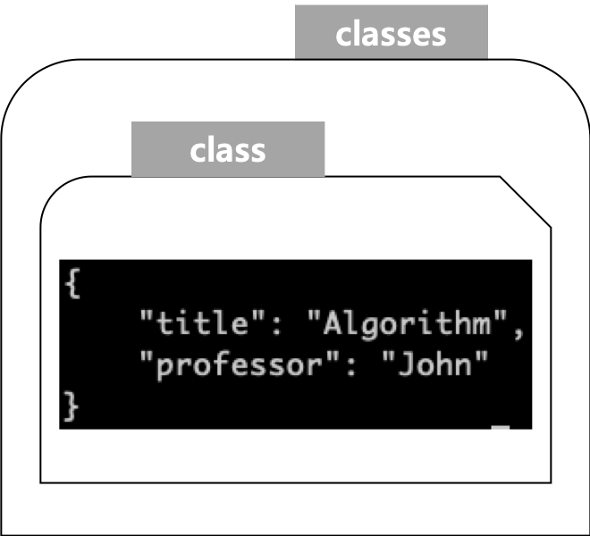

# docker 기반 개발용 Elastic Search 설치

# 1. docker network 생성/삭제

ES가 다른 네트워크와 통신하기 위해서는 네트워크를 생성해야 편하다고 한다. 자세한 내용은 계속 공부를 해가다 보면 알게 될 것 같다. 같은 네트워크에 연결된 다른 서비스에 연결할 때 유용하게 사용되는 개념이다.  

**참고자료**

- [docker network rm](https://docs.docker.com/engine/reference/commandline/network_rm/)


## 예) docker network 생성

net-es-chartnomy 라는 이름의 docker network를 생성한다.

```bash
$ docker network create net-es-chartnomy
```


## 예) docker network 삭제

생성했던 network인 net-es-chartnomy를 삭제하는 명령이다.

```bash
$ docker network rm net-es-chartnomy
```


# 2. docker Elastic Search 구동

[공식 docker hub repository](https://hub.docker.com/_/elasticsearch) 에서 제공하는 예제는 volume 연동이 없긴 하다. 일단 공식 페이지 지원 스크립트를 응용한 스크립트는 아래와 같다.

```bash
$ docker container run --rm -d \ 
		--name es-chartnomy --net net-es-chartnomy \
		-p 9200:9200 \
		-p 9300:9300 \
		-e "discovery.type=single-node" \
		elasticsearch:7.8.0
```


- -- rm 옵션
  - container 를 중지 시키면 해당 container를 삭제하는 옵션이다. 
    - 필수 옵션은 아니고, 선택사항이다.
    - 개발용으로 docker를 띄울때 작업이 끝나면 개발 PC에 docker container가 남아있는게 별로 마음에 들지 않아서 설정했다.
- -d 
  - daemon으로 돌리겠다는 의미의 옵션이다. (background로 동작하게 된다.)
- --name
  - 구동할 컨테이너의 이름을 지정해준다.
- --net
  - 사용할 도커 network를 지정해준다.
  - kibana등을 연동할 때 유용하다고 한다.
  - 같은 네트워크에 연결된 다른 서비스에 연결할 때 유용하다고 한다.
- -p
  - 포트번호를 지정해주는 옵션이다.
- -e
  - 환경변수를 지정해준다.
- elasticsearch:7.8.0
  - elasticsearch 7.8.0 태그가 붙은 이미지를 pull 해온다.


위의 명령어에서 역슬래시(\\)를 제거하고 메모한 명령어는 아래와 같다.

```bash
$ docker container run --rm -d --name es-chartnomy --net net-es-chartnomy -p 9200:9200 -p 9300:9300 -e "discovery.type=single-node" elasticsearch:7.8.0
```


# 3. docker Elastic Search bash 접속

```bash
$ docker container exec -it es-chartnomy sh
```


# 4. docker Elastic Search 정지시키기

```bash
$ docker container stop es-chartnomy
```


# 5. GET/POST/PUT/DELETE 실습

## GET 

현재 classes라는 이름의 index가 존재하지 않기 때문에 404 에러를 낸다.  

```bash
$ curl -XGET http://localhost:9200/classes
{"error":{"root_cause":[{"type":"index_not_found_exception","reason":"no such index [classes]","resource.type":"index_or_alias","resource.id":"classes","index_uuid":"_na_","index":"classes"}],"type":"index_not_found_exception","reason":"no such index [classes]","resource.type":"index_or_alias","resource.id":"classes","index_uuid":"_na_","index":"classes"},"status":404}%
```


? pretty를 붙여서 포매팅한 데이터를 확인하기

```bash
$ curl -XGET http://localhost:9200/classes?pretty
{
  "error" : {
    "root_cause" : [
      {
        "type" : "index_not_found_exception",
        "reason" : "no such index [classes]",
        "resource.type" : "index_or_alias",
        "resource.id" : "classes",
        "index_uuid" : "_na_",
        "index" : "classes"
      }
    ],
    "type" : "index_not_found_exception",
    "reason" : "no such index [classes]",
    "resource.type" : "index_or_alias",
    "resource.id" : "classes",
    "index_uuid" : "_na_",
    "index" : "classes"
  },
  "status" : 404
}
```


## PUT

인덱스 'classes'를 생성해보자

```bash
$ curl -XPUT http://localhost:9200/classes
{"acknowledged":true,"shards_acknowledged":true,"index":"classes"}%
```

결과확인

```bash
curl -XGET http://localhost:9200/classes\?pretty
{
  "classes" : {
    "aliases" : { },
    "mappings" : { },
    "settings" : {
      "index" : {
        "creation_date" : "1595070190155",
        "number_of_shards" : "1",
        "number_of_replicas" : "1",
        "uuid" : "Fky_wDQmQt28vahx_WJTcQ",
        "version" : {
          "created" : "7080099"
        },
        "provided_name" : "classes"
      }
    }
  }
}
```


## DELETE

인덱스 'classes' 를 삭제해보자.

```bash
$ curl -XDELETE http://localhost:9200/classes
{"acknowledged":true}%
```


결과 확인 (인덱스 'classes' 가 삭제되었는지 확인)

```bash
$ curl -XGET http://localhost:9200/classes\?pretty
{
  "error" : {
    "root_cause" : [
      {
        "type" : "index_not_found_exception",
        "reason" : "no such index [classes]",
        "resource.type" : "index_or_alias",
        "resource.id" : "classes",
        "index_uuid" : "_na_",
        "index" : "classes"
      }
    ],
    "type" : "index_not_found_exception",
    "reason" : "no such index [classes]",
    "resource.type" : "index_or_alias",
    "resource.id" : "classes",
    "index_uuid" : "_na_",
    "index" : "classes"
  },
  "status" : 404
}
```


## POST

document 를 생성해보자. document는 

- 인덱스가 있을 때 만들어도 되고, 
- 인덱스가 없을 때는 인덱스 명과 타입명을 지정해주면 바로 다큐먼트 생성이 가능하다.

> 형식)  
>
> curl -XPOST http://localhost:9200/[인덱스명]/[타입명]/아이디/ -d {...}

```bash
$ curl -XPOST http://localhost:9200/classes/class/1/ \ 
		-H'Content-Type: application/json' \ 
		-d '{"title": "Algorithm", "professor": "John"}'
		
# 결과화면
{"_index":"classes","_type":"class","_id":"1","_version":1,"result":"created","_shards":{"total":2,"successful":1,"failed":0},"_seq_no":0,"_primary_term":1}%
```

역슬래시(\\) 제거한 명령어

```bash
$ curl -XPOST http://localhost:9200/classes/class/1/ -H 'Content-Type: application/json' -d '{"title": "Algorithm", "professor": "John"}'
```


이렇게 해서 생성된 document 의 구조는 아래와 같다.



classes 는 인덱스 명이다. class는 타입 명이다. 여기서 타입명이라는 것은 JSON의 Object 단위를 이야기하는 것으로 보인다. 보통 Java에서도 보통 Class를 타입명이라고 부르고, IDE나 이런곳의 단축키를 찾다보면 Find Type 이렇게 표시하는 것을 떠올리면 이해가 될 듯 하다.  

  

### 참고 ) Content-Type application/x-www-form-urlencoded is not supported

에러 문구로 Content-Type application/x-www-form-urlencoded is not supported 라는 문구가 나타날 수 있다. 이 경우 아래와 같이 옵션을 추가해주면 된다.

```bash
-H 'Content-Type: application/json'
```


# 6. document 를 파일로 저장하여 파일 기반으로 document 생성하기

샘플 다큐먼트 (testclass.json)

```json
{
    "title": "Business Intelligence",
    "Professor": "JiGi",
    "major": "Computer Science",
    "semester": ["spring", "fall"],
    "student_count": 100,
    "unit": 3,
    "rating": 5
}
```


```bash
$ curl -XPOST http://localhost:9200/classes/class/1 -H 'Content-Type: application/json' -d @testclass.json

# 결과화면 
{"_index":"classes","_type":"class","_id":"1","_version":2,"result":"updated","_shards":{"total":2,"successful":1,"failed":0},"_seq_no":1,"_primary_term":1}%
```


## 결과 확인

```bash
$ curl -XGET http://localhost:9200/classes/class/1\?pretty
{
  "_index" : "classes",
  "_type" : "class",
  "_id" : "1",
  "_version" : 2,
  "_seq_no" : 1,
  "_primary_term" : 1,
  "found" : true,
  "_source" : {
    "title" : "Business Intelligence",
    "Professor" : "JiGi",
    "major" : "Computer Science",
    "semester" : [
      "spring",
      "fall"
    ],
    "student_count" : 100,
    "unit" : 3,
    "rating" : 5
  }
}
```


# 참고할만한 자료들

- [docker hub - elasticsearch](https://hub.docker.com/_/elasticsearch)
- [elasticsearch 공식문서](https://www.elastic.co/guide/en/elasticsearch/reference/current/docker.html)
  - volume 마운트 관련해서 찾아보다가 공식문서를 접했다...
  - docker hub 내의 명령어들은 자세하지 않다. 기본적인 명령어들만 구비되어 있다. elasticsearch 공식문서를 참고하자.
- [ElasticSearch on Kubernetes](https://sematext.com/blog/kubernetes-elasticsearch/)
- [docker network rm](https://docs.docker.com/engine/reference/commandline/network_rm/)
- [허민석 교수님  github](https://github.com/minsuk-heo/BigData)
- [ElasticSearch REST 요청시 application/x-www-form-urlencoded is not supported 에러가 날때 해결법](https://abc2080.tistory.com/entry/%EC%97%90%EB%9F%AC-ContentType-header-applicationxwwwformurlencoded-is-not-supported)

