# 2020-2.EC2생성

# 1. AWS의 프리티어 플랜

EC2 사용시 아래와 같은 제한이 있다.

- T2.micro 의 사양만 가능하다.
  - vCPU (가상 CPU) 1 Core, 메모리 1GB
  - vCPU는 물리 CPU 사양의 절반정도의 성능을 가진다
  - 월 750 시간의 제한이 있다. 초과하면 비용이 부과된다. 
    - 24시간 x 31일 = 744 시간
    - 즉, 1대의 t2.micro 만 사용할 경우 24시간 사용할 수 있다.

# 2. EC2 생성 작업

AWS Management Console > EC2 검색

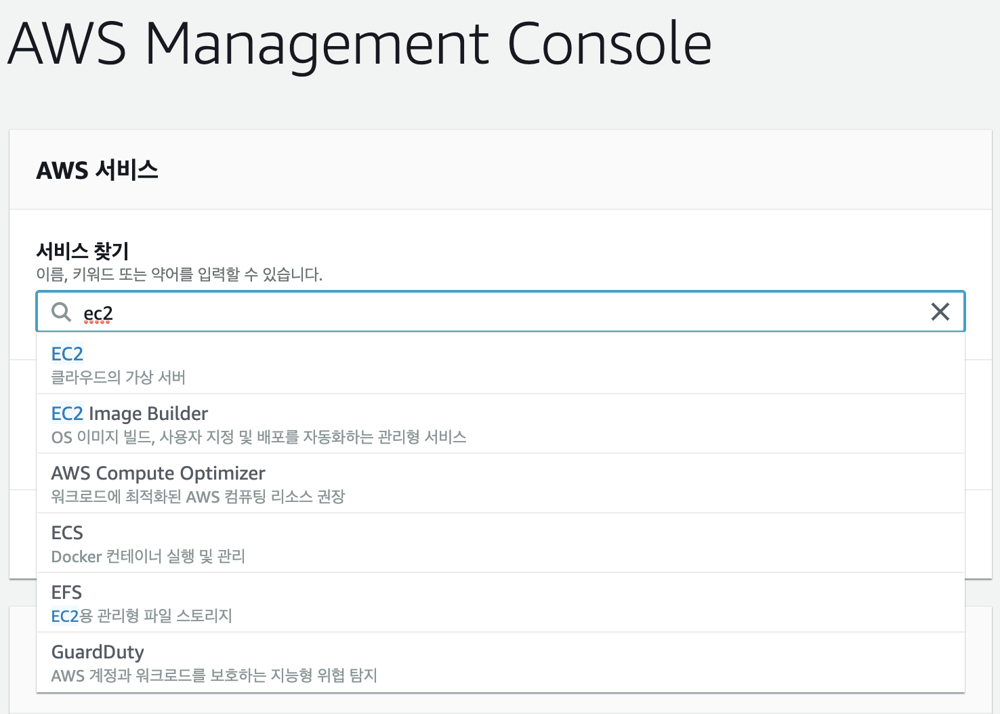

[인스턴스 시작] 을 클릭한다.

AMI 는 Amazon Linux 로 설정한다.

centos 로 별도 선택해도 무방하다. 다만 Amazon Linux가 지원이 빠르게 된다는 장점이 있다.

\- AMI

 : EC2 인스턴스를 시작하는 데 필요한 정보를 이미지로 만들어 둔 것. 

 : 인스턴스라는 가상 머신에 운영체제 등을 설치할 수 있게 구워넣은 이미지라고 생각하면 된다.

Amazon Linux는 

- Amazon Linux 1 
- Amazon Linux 2

가 있는데 이중 Amazon Linux 1 을 선택한다. (2버전이 최신버전이라 국내 자료가 아직은 많지 않다.)

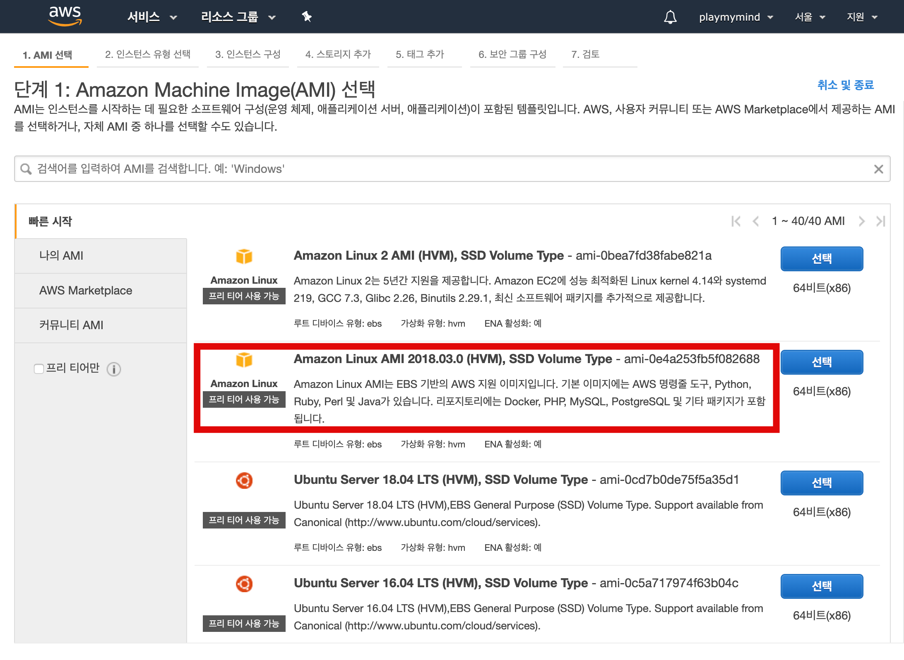

2020/08/15 현재 변경된 내용)  

> Amazon Linux 2 를 선택했다.

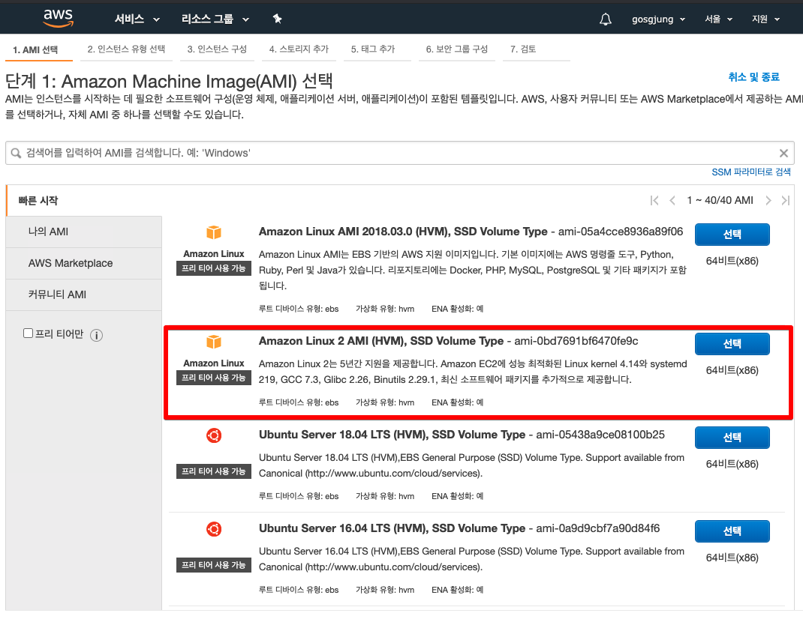

인스턴스 유형 선택

- t2.micro 를 선택한다.
- [다음: 인스턴스 세부 구성] 선택

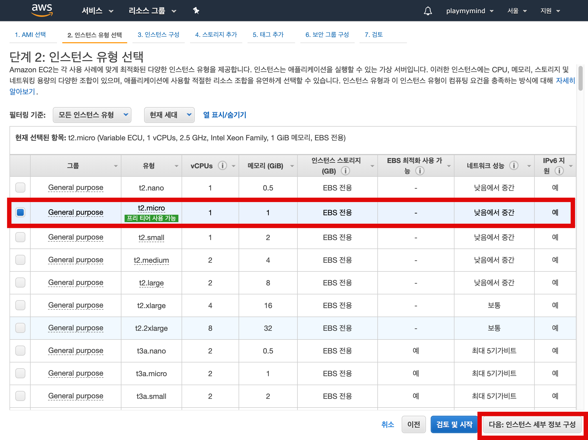

인스턴스 구성 에서는 별다른 설정 없이 [다음: 스토리지 추가]른 선택해준다.  

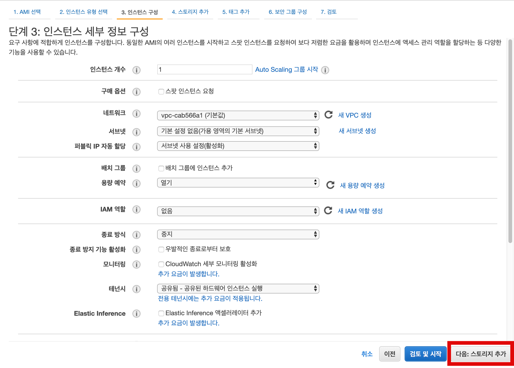

스토리지 추가  

보통은 30GB로 넓혀서 무료로 사용할 수 있다는 것을 모르는 사람들이 많다고 한다. SSD의 사이즈를 30GiB로 늘려주자!!  

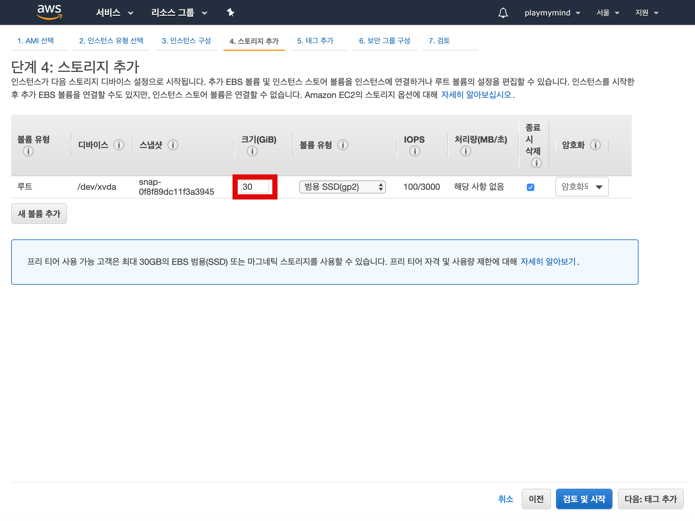

태그 추가

웹 콘솔에서 표기될 EC2에 태그를 붙이는 과정이다 인스턴스가 많을 때 태그별로 구분해 그룹짓기 편하다. 인스턴스에 태그를 붙여보자

- 키
  - Name
- 값
  - ec2-web-stockdata (임의 지정함)

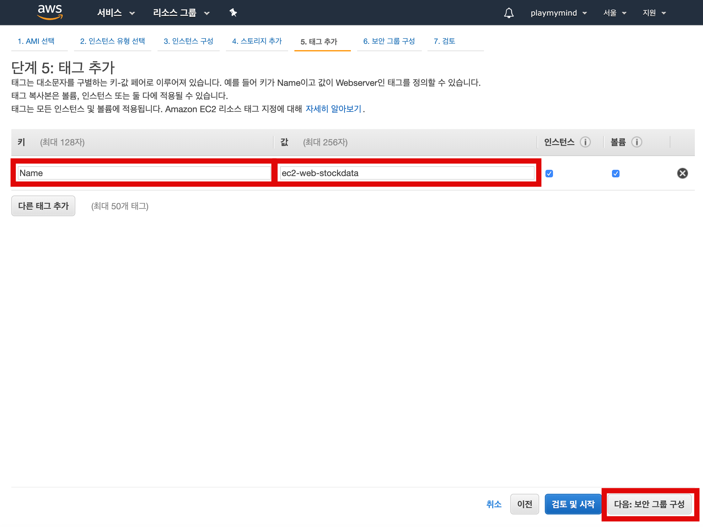

: 2020/08/15 현재 변경 내용)

태그명 바꿨다.

- 키
  - Name
- 값
  - ec2-web-chartnomy

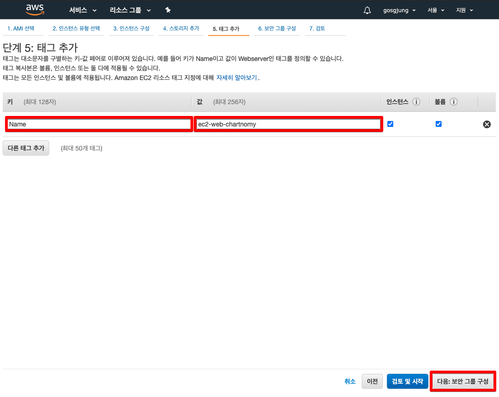

보안 그룹 생성

보안 그룹 이름과 설명 부분은 나중에 봤을때 알아볼수 있는 이름으로 바꿔주면 좋다.

- 보안 그룹 이름 :
- - ec2-web-stockdata
- 설명 :
- - ec2-web-stockdata-security

pem 키 없이는 접속이 안되는 것이라고 생각해 전체 주소(0.0.0.0/0, ::/0)을 하는 경우가 있는데, 이렇게 했을때

파일공유 디렉터리/깃허브 등에 실수로 pem을 노출했을 때 가상화폐가 채굴될수도 있다. 

**pem키가 노출되었을 경우를 대비해 허용된 ip 주소만 접근 가능하도록 폐쇄적으로 보안정책**을 만들자.

여기서는 집의 IP를 추가해주었다.

가끔 다른 IP(카페, 회사 등에서 접속할 때는 해당 장소의 IP)를 SSH 규칙에 추가해주면 안전하다.

8080을 전체 포트로 열어놓는 것은 위험하지 않으므로 [검토 및 시작하기] 고고!!

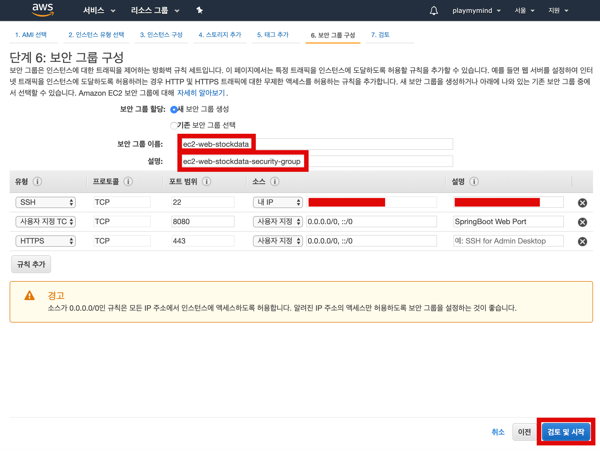

: 2020/08/15 현재 변경내용)  

보안그룹 이름을 내가 알수 있는 이름으로 바꿔주었다.

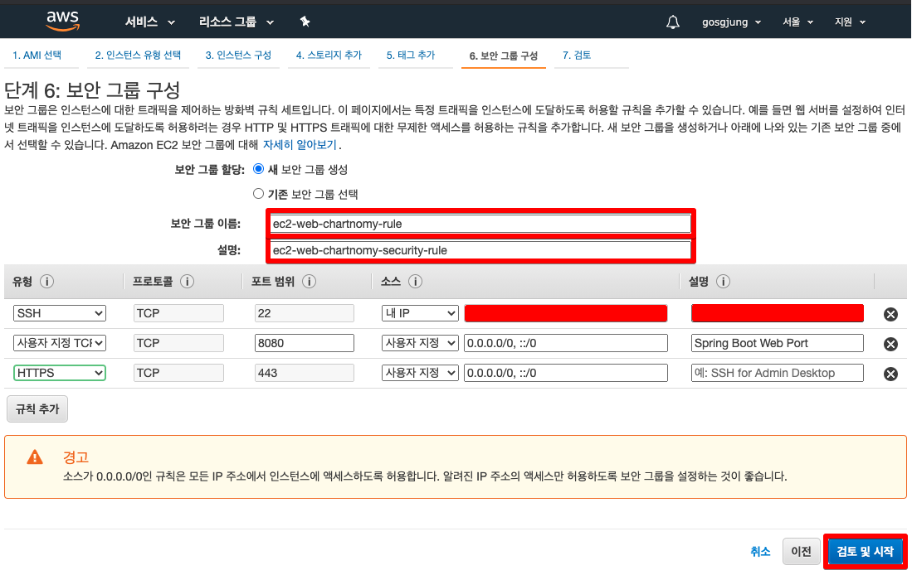

[시작하기] 고고!!

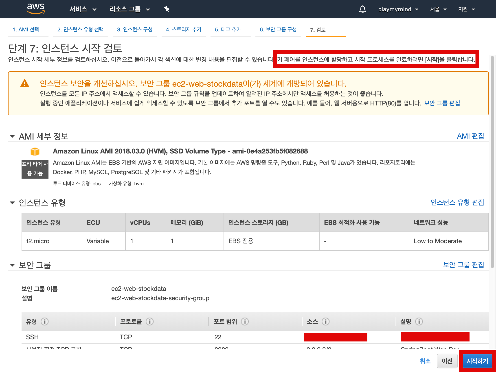

키페어 생성  

키페어 이름  

 \- ec2-web-stockdata (알아볼수 있는 이름으로 지었다.)  

  

2020/08/20 현재 변경 내용)

: 키페어 새로 생성, 이름을 다시 지정함

 

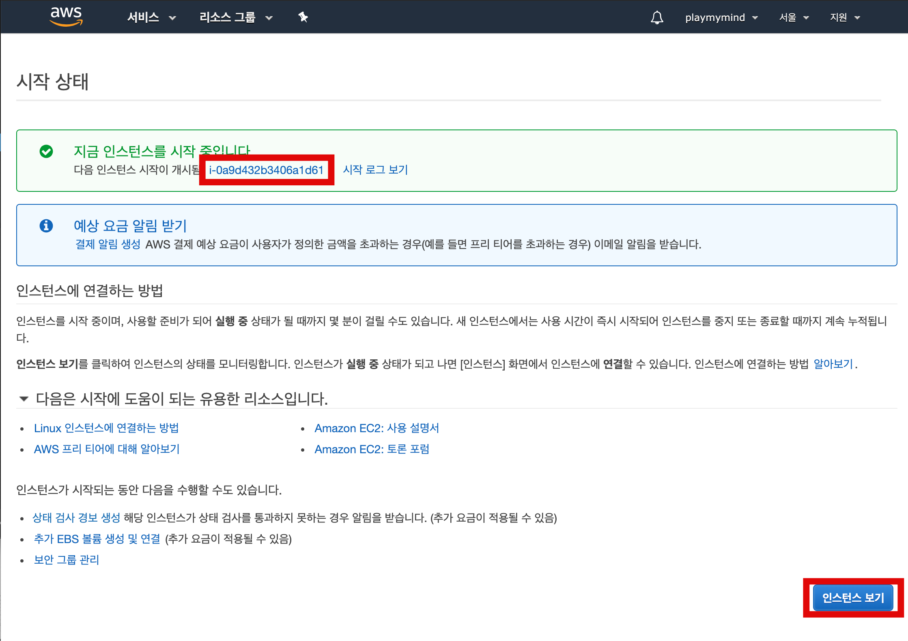

인스턴스를 확인해보면 아까 입력한 Name 태그에 대해 ec2-web-stockdata 인스턴스가 동작하는 것을 확인 가능하다.

IP도 할당되어 있고 그러하다. 근데, 인스턴스를 잠시 중지했다가 다시 시작시키면 IP가 변경된다. 이렇게 되면 매번 접속해야 하는 IP가 변경되서 PC에서 접근할 때마다 IP주소를 확인해야 한다. 번거로워지므로 인스턴스의 IP가 매번 변경되지 않고 고정 IP를 가지게 해줘야 한다.

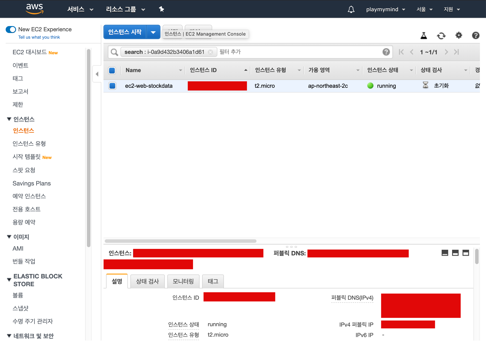

  

고정 IP 할당 (EIP 할당)  

AWS의 고정 IP를 Elastic IP(EIP, 탄력적 IP) 라고 한다. 

요금을 아끼기 위해 잠깐 인스턴스를 중지하고 다시 시작하면 IP가 변경되는데, 이렇게 하면, 접속할 때마다 매번 접속할 IP가 변경되기 때문에 AWS Console에 접속해 IP 주소를 확인해야 한다. 이런 이유로 고정 IP를 적용해야 하는데, AWS의 고정 IP 를 Elastic IP, EIP, 탄력적 IP 라고 부른다.

EC2 인스턴스 페이지의 왼쪽 카테고리에서 탄력적 IP를 눌러 선택 

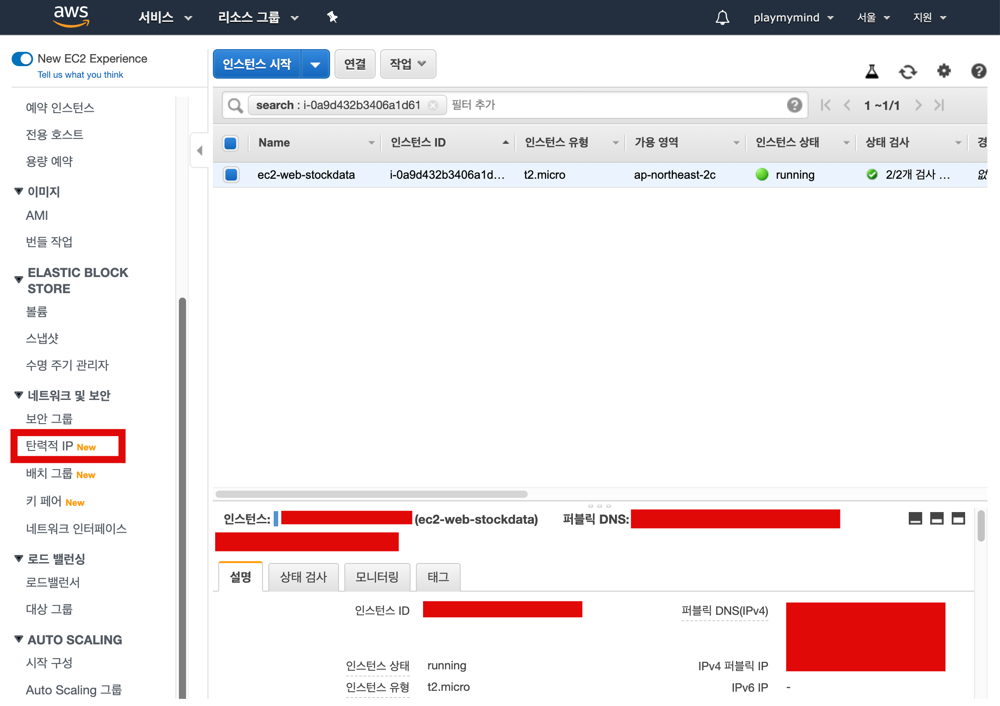

주소가 없으므로 [새 주소 할당] 버튼을 클릭해 바로 [할당]버튼을 클릭한다.

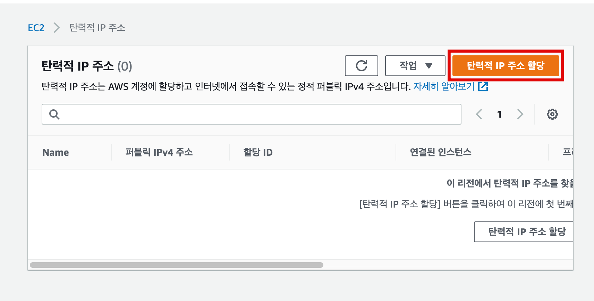

할당 버튼 클릭

할당 완료.

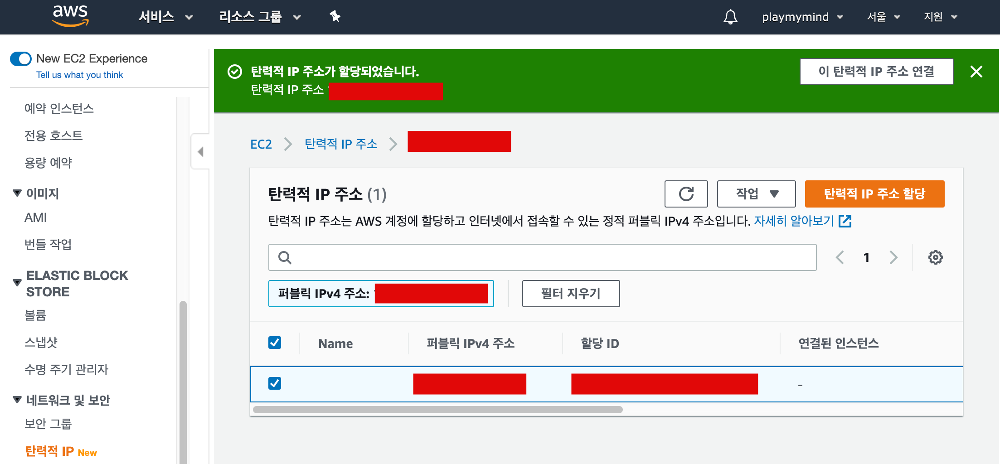

  

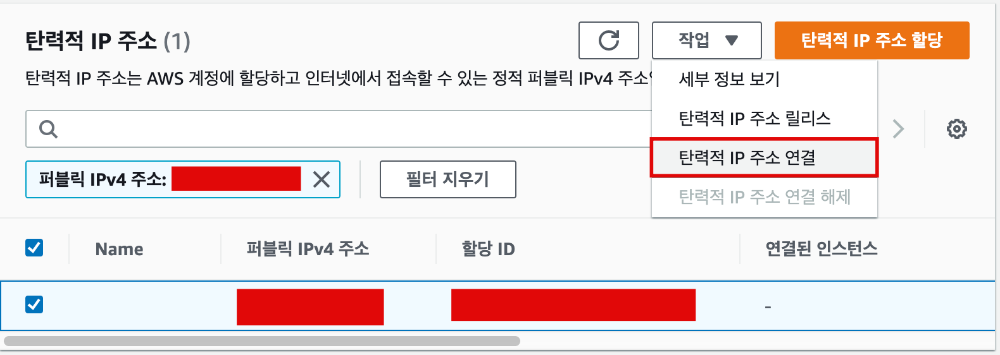

EC2 인스턴스 생성시 입력한 태그 명인 ec2-web-stockdata 를 입력해 검색하여 인스턴스를 찾아서 선택한 후 [연결]버튼 클릭  

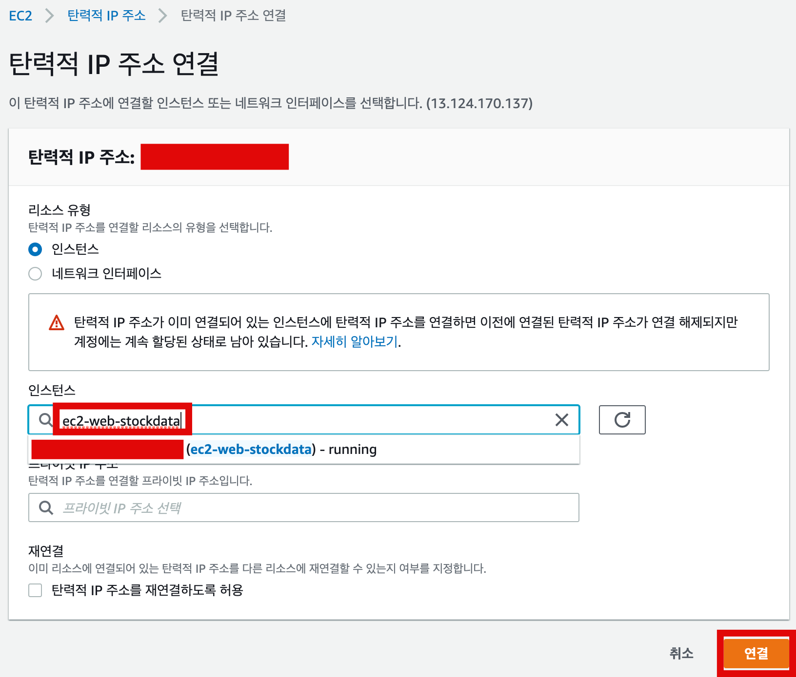

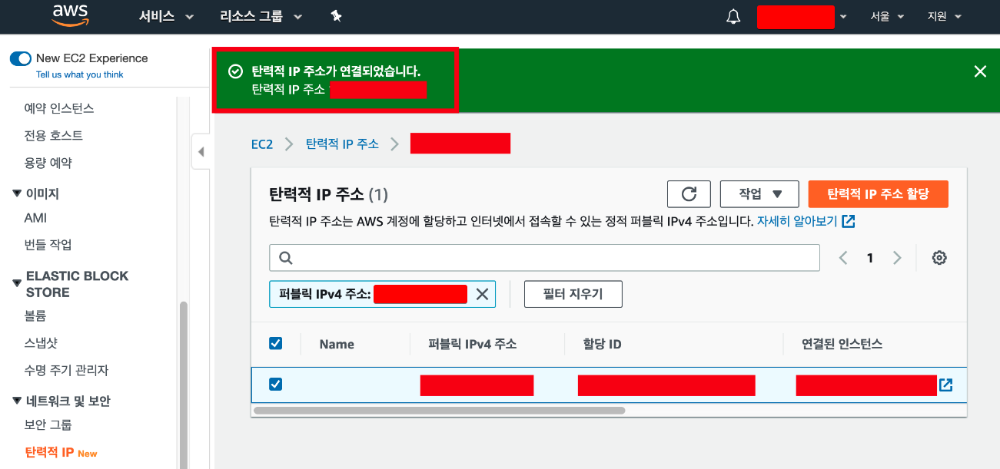

탄력적 IP 확인  

좌측 사이드 메뉴 > [인스턴스] 클릭  

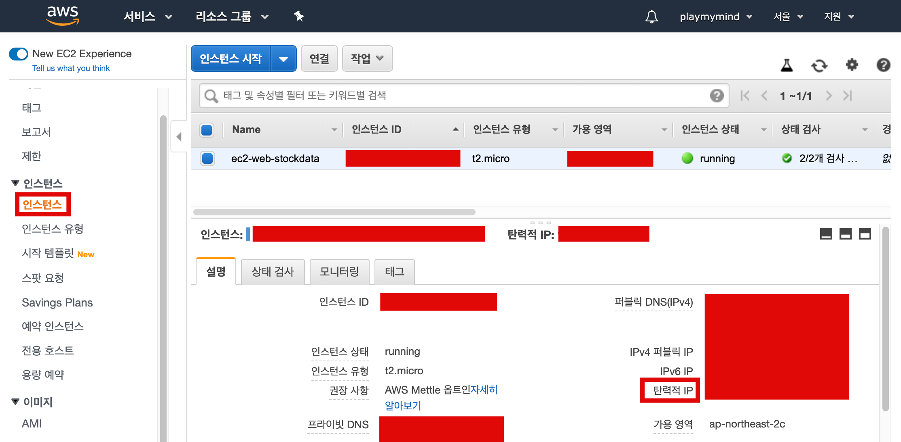

탄력적 IP 사용시 주의점

- 생성 후 EC2에 연결하지 않으면 비용이 발생한다. 
- 생성한 탄력적 IP는 무조건 EC2에 바로 연결해야 한다. (연결하지 않으면 비용이 발생한다고 한다.)
- 더 이상 사용할 인스턴스가 없을 때 탄력적 IP를 찾아서 삭제해주어야 한다.
- 삭제 안하면 마찬가지로 비용청구가 된다.

