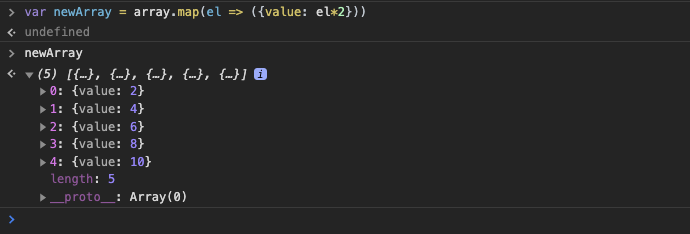

# ES6 기본 개념

항상 누군가가 이거 알아? 하면서 설명해줬다. 교육을 들으면서 항상 이거 중요해요. 하며 설명을 들었다. 머릿속에는 넣어놨었다. 그런데 또 막상 몇 개월 지난 후 쓰려고 하면 겁이 난다. 그럴 때 있다. 간단하게 레시피처럼 기본적인 개념들만 정리해본다. 

# 1. 구조분해 할당, 비구조화 할당 (destructuring assignment)

배열이나 객체에서 원하는 값 만을 추려내고자 할 때 사용하는 개념이다.

**참고 자료**

- [MDN - Destructuring Assginment](https://developer.mozilla.org/ko/docs/Web/JavaScript/Reference/Operators/Destructuring_assignment)

## 배열 구조분해 할당

### 예제 1)


  

### 예제 2)


  

## 객체 구조분해 할당

### 예제 1)


  

## vue.js 디렉티브에서 활용

```vue
<ul>
    <li v-for="{id, name} in list" :key="id"> ... </id>
</ul>
```


# 2. Spread 연산자 (전개 연산자)

**참고자료**

- [Spread 연산자](https://developer.mozilla.org/ko/docs/Web/JavaScript/Reference/Operators/Spread_syntax)


예를 들기 위해 선언한 array 라는 이름의 배열을 선언했다.


  

예를 들기 위해 saySpread() 라는 이름의 함수를 만들었다.


이 때 Spread 연산자로 아무 인자를 전달해보는 예제들은 아래와 같다.  

  

### 예제 1) array의 0 ~ n 중에서 array[0], array[1] 만을 골라서 할당해 saySpread(...) 에 전달


  

### 예제 2) array[0] 을 두번째 인자로 전달


### 예제 3) 전개(Spread)연산자를 사용하지 않고 array를 전달할 경우의 출력결과


# 3. 템플릿 리터럴

참고자료

- [Template Literal](https://developer.mozilla.org/ko/docs/Web/JavaScript/Reference/Template_literals)

보통 대부분의 프로그래밍 언어들은 문자열을 작은 따옴표(''), 큰 따옴표("") 로 감싸서 처리한다.  

ES6 버전의 javascript 에서는 작은 따옴표, 큰 따옴표 외에도 역 따옴표(backquote - ``) 로 문자열을 감싸서 처리 가능하다.  

이렇게 역따옴표를 사용할 경우의 장점은 아래와 같다.  

- 문자열 내부에서 줄바꿈을 할 수 있고
- 문자열 내부에 변수를 넣을 수도 있다.

  

예제


  

# 4. 변수 선언 방식 - const, let, var

  

# 5. 화살표 함수 및 함수 선언 방식

참고자료

- [화살표함수 - MDN](https://developer.mozilla.org/ko/docs/Web/JavaScript/Reference/Functions/%EC%95%A0%EB%A1%9C%EC%9A%B0_%ED%8E%91%EC%85%98
)

  

주의

- Vue.js 사용시 Vue 인스턴스를 this로 사용할 경우에는 사용하지 않는 것이 좋다. 기본적인 익명함수를 정의할 때는 편리하게 사용가능하다.

  

### 예제 1) array 라는 이름의 배열을 일괄적으로 100 씩 곱하는 예

(map 함수에는 보통 callback 함수를 전달하여 배열에 대해 처리할 로직을 구현한다. 그리고, map 함수를 통해 가공되어 리턴된 배열은 새로운 변수이다.)


  

### 예제 2) 화살표 함수를 map 내에 인자로 전달해보기


  

### 예제 3) return 문을 생략한 화살표함수를 map 함수에 전달하는 예


  

### 예제 4) 하나 이상의 매개변수를 화살표함수에 전달할 때


  

### 예제 5) 화살표 함수 내에서 객체를 리턴하는 경우

return 구문을 생략하고 객체를 리턴할 경우는 {} 로 감싸서 리턴해주어야 한다.  




# 6. promise

  

# 7. async, await


# 8. 고차함수, 고계함수
