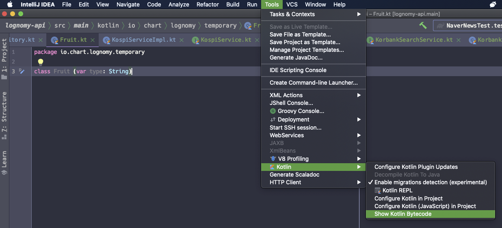
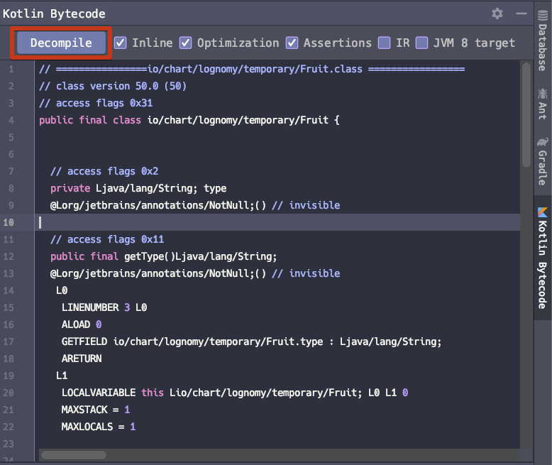

# Java 변환 코드 확인방법

gitbook.io 블로그에 정리했던 내용을 이곳에 백업을 위한 용도로 남겨두었다.

- [gitbook 블로그 - 3분 코틀린 / Java 변환 코드 확인방법](https://gosgjung.gitbook.io/lognomy/kotlin-study/3/java)

# 들어가면서 ... ‌

코틀린으로 짠 코드를 Java 로 확인해봐야 개념 파악이 쉬운 경우가 있다. 나의 경우는 처음 배울 때 Kotlin Bytecode로 변환하는 법까지는 확인했는데... 외계어로 변환된 모습을 보고 아... 이러면서 접었었는데 다시 확인해보니 Decompile 버튼을 내가 누르지 않아서 생긴 불상사였다.


# Bytecode 로 변환‌

## kotlin 코드‌

아래와 같이 Fruit.kt 라는 클래스가 있다고 해보자.

**Fruit.kt**

```kotlin
class Fruit (var type: String)
```


## 바이트 코드 변환

위에서 작성한 Fruit.kt 파일을 바이트코드로 변환해보자.  

Fruit.kt 파일을 열고 아래와 같이 메뉴를 클릭해 이동하자.  

- Tools -> Kotlin -> Show Kotlin Bytecode 메뉴 클릭



  

또는 우측 사이드바의 Kotlin Bytecode 메뉴를 클릭해서 바이트 코드를 확인 가능하다.


  

# Java 코드 변환 

Decompile 버튼을 눌러서 바이트 코드를 java 코드로 변환하자




## Decompile 된 Java 코드

Fruit.kt 라는 코틀린 파일이 Fruit.decopiled.java 로 변환된 모습을 확인할 수 있다.


# 코틀린 코드와 자바 코드 비교해보기

코틀린으로 작성한 Fruit.kt의 내용은 아래와 같다.

```kotlin
package io.chart.lognomy.temporary

class Fruit (var type: String)
```

  

Java 코드로 변환된 Fruit.decompiled.java 는 아래와 같다.

```kotlin
package io.chart.lognomy.temporary;

import kotlin.Metadata;
import kotlin.jvm.internal.Intrinsics;
import org.jetbrains.annotations.NotNull;

@Metadata(
   mv = {1, 1, 16},
   bv = {1, 0, 3},
   k = 1,
   xi = 2,
   d1 = {"\u0000\u0012\n\u0002\u0018\u0002\n\u0002\u0010\u0000\n\u0000\n\u0002\u0010\u000e\n\u0002\b\u0005\u0018\u00002\u00020\u0001B\r\u0012\u0006\u0010\u0002\u001a\u00020\u0003¢\u0006\u0002\u0010\u0004R\u001a\u0010\u0002\u001a\u00020\u0003X\u0086\u000e¢\u0006\u000e\n\u0000\u001a\u0004\b\u0005\u0010\u0006\"\u0004\b\u0007\u0010\u0004¨\u0006\b"},
   d2 = {"Lio/chart/lognomy/temporary/Fruit;", "", "type", "", "(Ljava/lang/String;)V", "getType", "()Ljava/lang/String;", "setType", "lognomy-api.main"}
)
public final class Fruit {
   @NotNull
   private String type;

   @NotNull
   public final String getType() {
      return this.type;
   }

   public final void setType(@NotNull String var1) {
      Intrinsics.checkNotNullParameter(var1, "<set-?>");
      this.type = var1;
   }

   public Fruit(@NotNull String type) {
      Intrinsics.checkNotNullParameter(type, "type");
      super();
      this.type = type;
   }
}
```


