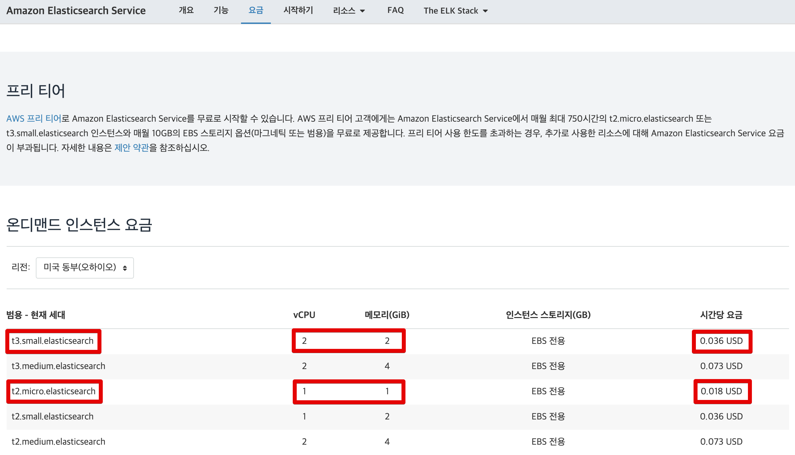

# 요금제 선택

# 참고자료

[Amazon Elasticsearch Service 요금 - aws.amazon.com](https://aws.amazon.com/ko/elasticsearch-service/pricing/?nc=sn&loc=3)

# Amazon ES 온디맨드 요금 정책 (프리티어)

Amazon Elasticsearch Service 의 [온디맨드 요금 페이지](https://aws.amazon.com/ko/elasticsearch-service/pricing/?nc=sn&loc=3)를 보면 AWS 프리티어에 한해서 아래의 1년 한정 무료옵션을 제공한다.

- 매월 최대 750시간, 매월 10GB EBS 스토리지 옵션
- t2.micro.elasticsearch
- t3.small.elasticsearch

시간이 흐르면 요금 약정도 변할수 있는 것이기 때문에 2020/12월 현재의 요금약관을 캡처로 남겨두고자 한다. 나중에 아마존 측의 사업적인 요건이 변화되어 요금정책을 바꾸게 되면 이 문서가 예전 문서라는 걸 확인할 수 있기 때문에...  

‌

유료로 변경했을 때의 요금 역시 계산하지 않을 수 없어서 계산을 해보았다.‌

t3.small.elasticsearch

- vCPU : 2, 메모리 : 2GiB
- 시간당 요금 : 0.036USD
- 31일 무중단 운영시 요금 : 0.036 x 24 x 31= 26.784$

t2.micro.elasticsearch

- vCPU : 1, 메모리 1GiB
- 시간당 요금 : 0.018USD
- 31일 무중단 운영시 요금 : 0.018 x 24 x 31 = 13.392$

  

(현재 위의 두개의 인스턴스 종류들 중에서 t2 계열의 인스턴스 클래스는 Amazon Elasticsearch Service 에서는 지원하지 않는 것으로 보인다.)

  

일단은... 한달은 t2 를 써보고 다른 한달은 t3 로 써보고, 또는 ELB를 적용해보고, 스케일링도 걸어보고 해봐야하고 Fault Zone 에 대해서도 공부해보고 실습해보고 그럴 계획이다. 설치했다 지웠다 이런 작업들을 엄청 자주할 것 같고, 내가 원하는 요금 체계를 찾게 되지 않을까 싶기도 하다.  