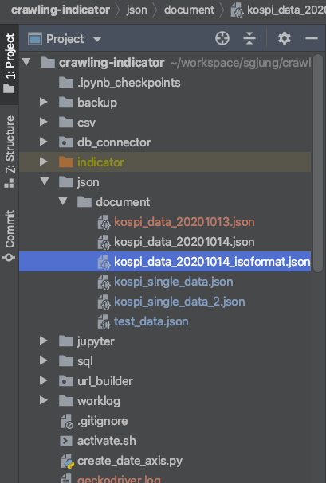

# KOSPI 데이터 크롤링 및 Bulk 데이터(JSON) 생성

> [한국은행 경제 통계시스템 API](http://ecos.bok.or.kr/) 을 활용해서 코스피 데이터를 얻어오고, 얻어온 데이터를 CURL 커맨드로 ELK에서 Bulk Insert 할 수 있는 JSON 형식으로 가공하는 절차이다.

  

# 환경설정

## requirements.txt

현재 시점에서 urllib3의 최신 버전은 1.25.10 이다. 하지만 최신버전이 불안정한 편이다. 따라서 이 예제에서는 1.25.9 버전의 urllib3 라이브러리를 사용한다.

```bash
$ vim requirements.txt


urllib3==1.25.9
:wq
```

  

## 가상환경 설정

```bash
$ pip install virtualenv
$ virtualenv ecos-crawler
$ source ecos-crawler/bin/activate
$ (ecos-crawler) pip install -r requirements.txt
```


# python 코드

코드가 그리 어렵지 않다. 따로 설명을 정리해놓을 필요는 없을 듯 하다.

```bash
import urllib3
import json
import os
import datetime

date_formatter = '%Y%m%d'

COLUMN_LIST = [
        'STAT_NAME',  'STAT_CODE',  'ITEM_CODE1', 'ITEM_CODE2', 'ITEM_CODE3',
        'ITEM_NAME1', 'ITEM_NAME2', 'ITEM_NAME3', 'DATA_VALUE', 'TIME'
    ]

api_key = '--'

def custom_converter(obj):
    if isinstance(obj, datetime.datetime):
        return obj.isoformat().__str__()


if __name__ == '__main__':
    url = "http://ecos.bok.or.kr/api/StatisticSearch/{}/json/kr/1/50000/064Y001/DD/20190101/20201231/0001000" \
        .format(api_key)

    print(" ####### URL #######")
    print(url)

    http = urllib3.PoolManager()
    ret = http.request("GET", url, headers={'Content-Type': 'application/json'})

    str_response = ret.data.decode('utf-8')
    dict_data = json.loads(str_response)

    arr_data = dict_data['StatisticSearch']['row']

    directory = 'json/document/'
    if not os.path.exists(directory):
        os.makedirs(directory)

    with open('json/document/kospi_data_20201014_isoformat.json', 'w+') as f:
        for e in arr_data:
            # type 을 지정할 경우 (7.x 아래 버전)
            # dict_index = {'index': {'_index': 'indicators', '_type': 'kospi', '_id': e['TIME']}}

            # type 을 지정하지 않을 경우 (7.x 부터)
            # datetime 타입으로 변환
            e['TIME'] = datetime.datetime.strptime(e['TIME'], date_formatter)

            # index 표현 용도 딕셔너리에 임시 저장
            dict_index = {'index': {'_index': 'kospi', '_id': e['TIME']}}
            str_index_id = json.dumps(dict_index, default=custom_converter)
            stringified_json = str_index_id + "\n"

            stringified_json = stringified_json + json.dumps(e, default=custom_converter)
            stringified_json = stringified_json + "\n"
            print(stringified_json)
            f.write(stringified_json)
```


소스 코드의 원본은 https://github.com/soongujung/crawling-indicator 에 백업해두었다.  


# 실행 

```bash
$ source ecos-crawler/bin/activate
$ (ecos-crawler) python json-korbank-kospi.py
```

만들어진 json 파일의 이름은 `kospi_data_20201014_isoformat.json` 이다.   

