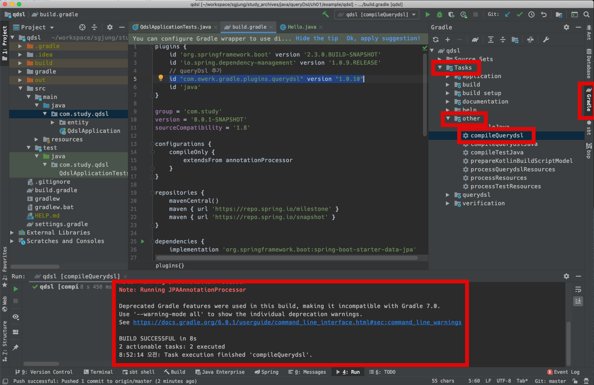
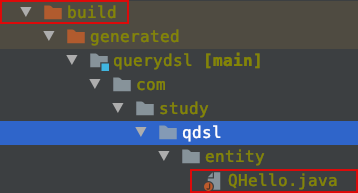

# QueryDsl 설정

QueryDsl은 gradle 빌드 과정 속에서 QType이라는 타입을 뽑아내야 한다고 한다. 그래서 환경설정이 따로 어렵다고 하는군.  

build.gradle 내의 plugins에 아래와 같이 

## plugins 설정

> ```groovy
> id "com.ewerk.gradle.plugins.querydsl" version "1.0.10"
> ```

을 추가해준다.

```groovy
plugins {
	id 'org.springframework.boot' version '2.3.0.BUILD-SNAPSHOT'
	id 'io.spring.dependency-management' version '1.0.9.RELEASE'
	// queryDsl 추가
	id "com.ewerk.gradle.plugins.querydsl" version "1.0.10"
	id 'java'
}
```


## dependency 설정

build.gradle 내에 아래와 같이 의존성을 추가한다.

> implementation 'com.querydsl:querydsl-jpa'

build.gradle 내부 내용중 일부

```groovy
...
dependencies {
	implementation 'org.springframework.boot:spring-boot-starter-data-jpa'
	implementation 'org.springframework.boot:spring-boot-starter-web'
	implementation 'com.querydsl:querydsl-jpa'

	compileOnly 'org.projectlombok:lombok'
	runtimeOnly 'com.h2database:h2'
	annotationProcessor 'org.projectlombok:lombok'
	testImplementation('org.springframework.boot:spring-boot-starter-test') {
		exclude group: 'org.junit.vintage', module: 'junit-vintage-engine'
	}
}
```


## build script

build.gradle 가장 하단에 아래와 같이 입력한다.

```groovy
...
...
//querydsl build 스크립트
def querydslDir = "$buildDir/generated/querydsl"

querydsl {
	jpa = true
	querydslSourcesDir = querydslDir
}
sourceSets {
	main.java.srcDir querydslDir
}
configurations {
	querydsl.extendsFrom compileClasspath
}
compileQuerydsl {
	options.annotationProcessorPath = configurations.querydsl
}
```


## build.gradle 전체 소스

```groovy
plugins {
	id 'org.springframework.boot' version '2.3.0.BUILD-SNAPSHOT'
	id 'io.spring.dependency-management' version '1.0.9.RELEASE'
	// queryDsl 추가
	id "com.ewerk.gradle.plugins.querydsl" version "1.0.10"
	id 'java'
}

group = 'com.study'
version = '0.0.1-SNAPSHOT'
sourceCompatibility = '1.8'

configurations {
	compileOnly {
		extendsFrom annotationProcessor
	}
}

repositories {
	mavenCentral()
	maven { url 'https://repo.spring.io/milestone' }
	maven { url 'https://repo.spring.io/snapshot' }
}

dependencies {
	implementation 'org.springframework.boot:spring-boot-starter-data-jpa'
	implementation 'org.springframework.boot:spring-boot-starter-web'
	implementation 'com.querydsl:querydsl-jpa'

	compileOnly 'org.projectlombok:lombok'
	runtimeOnly 'com.h2database:h2'
	annotationProcessor 'org.projectlombok:lombok'
	testImplementation('org.springframework.boot:spring-boot-starter-test') {
		exclude group: 'org.junit.vintage', module: 'junit-vintage-engine'
	}
}

test {
	useJUnitPlatform()
}

//querydsl build 스크립트
def querydslDir = "$buildDir/generated/querydsl"

querydsl {
	jpa = true
	querydslSourcesDir = querydslDir
}
sourceSets {
	main.java.srcDir querydslDir
}
configurations {
	querydsl.extendsFrom compileClasspath
}
compileQuerydsl {
	options.annotationProcessorPath = configurations.querydsl
}
```


# gradle compile 정상 동작 확인

- 우측 네비게이션 > Gradle 탭 클릭
- Tasks > other > compileQuerydsl 더블 클릭
- 하단 [RUN] 탭에서 BUILD SUCCESSFUL 메시지 뜨는지 확인하자




# QType 확인

## 테스트용 Entity 생성

- entity 패키지 생성

  - 

- entity 패키지 아래에 Hello.java 클래스 생성

- 소스코드는 아래와 같이 간단하다.

  - ```java
    package com.study.qdsl.entity;
    
    import javax.persistence.Entity;
    import javax.persistence.GeneratedValue;
    import javax.persistence.Id;
    import lombok.Getter;
    import lombok.Setter;
    
    @Entity
    @Getter @Setter
    public class Hello {
    
    	@Id @GeneratedValue
    	private Long id;
    }
    ```


## QType 확인

build.gradle에는 querydslDir의 값을 $buildDir/generated/querydsl 로 지정했었다.

### build.gradle 중 일부

```groovy
def querydslDir = "$buildDir/generated/querydsl"
```


build 디렉터리 확인  

그리고 build 디렉터리를 확인해보면  



QHello.java 라는 파일이 존재하는 것을 확인 가능하다. 이렇게 되는 이유는 방금 전 Task로 확인해본 compileQuerydsl 빌드 태스크 때문이다. compileQuerydsl 말고도 gradle 빌드를 해도 똑같이 QHello.java가 생성된다. (gradlew clean -> gradlew build 후에 확인 가능하며, 해당내용 스샷 첨부는 패스함.)


# 주의할 점

build 디렉터리 내의 generated 디렉터리 아래에 QType으로 생성된 Java 클래스들은 git과 같은 버전관리 서버에 커밋/푸시되면 안된다. 빌드 설정 등에 의해 잘못된 QType.java가 포함될 수 있기 때문이다. 다행히도 보통 IDE들의 기본 설정들이 .gitignore에 build 디렉터리를 포함하고 있기 때문에 웬만하면 git서버에 올라갈일은 드물다. (git 외의 버전관리는 ignore에 직접 추가해주어야 한다)

  

# 테스트 코드

```java
package com.study.qdsl;

import static org.assertj.core.api.Assertions.*;

import com.querydsl.jpa.impl.JPAQueryFactory;
import com.study.qdsl.entity.Hello;
import com.study.qdsl.entity.QHello;
import javax.persistence.EntityManager;
import javax.persistence.PersistenceContext;
import javax.transaction.Transactional;
import org.assertj.core.api.Assertions;
import org.junit.jupiter.api.Test;
import org.springframework.beans.factory.annotation.Autowired;
import org.springframework.boot.test.context.SpringBootTest;

@SpringBootTest
@Transactional
class QdslApplicationTests {

//	@PersistenceContext  // @Autowired 대신 @PersistenceContext 어노테이션으로 사용해도 무방해다
	@Autowired
	EntityManager em;

	@Test
	void contextLoads() {
		Hello hello = new Hello();
		em.persist(hello);

		JPAQueryFactory query = new JPAQueryFactory(em);
		QHello qHello = new QHello("h");

		Hello result = query
			.selectFrom(qHello) // query 와 관련된 것은 entity가 아니라 QType을 인자로 주어야 한다.
			.fetchOne();

		assertThat(result).isEqualTo(hello);
		assertThat(result.getId()).isEqualTo(hello.getId());
	}

}
```


