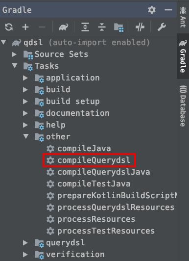

# QType의 개념 및 활용

# 샘플 데이터

예를 들어 아래의 데이터들이 들어있다고 하자.

```text
 member :: Member(id=4, username=John, age=23)
 member :: Member(id=5, username=Becky, age=22)
 member :: Member(id=6, username=Kyle, age=28)
 member :: Member(id=7, username=Stacey, age=24)
 member :: Member(id=8, username=Aladdin, age=35)
 member :: Member(id=9, username=Genie, age=41)
 member :: Member(id=10, username=Beethoven, age=251)
 member :: Member(id=11, username=Chopin, age=210)
 member :: Member(id=12, username=Genie, age=210)
 member :: Member(id=13, username=null, age=100)
```

우리는 이 데이터를 활용해 기본적인 Select 문을 QueryDsl 방식으로 작성할 것이다.  


# 엔티티 구현

## Member

```java
@Entity
@Getter @Setter
@NoArgsConstructor(access = AccessLevel.PROTECTED)
public class Member{
  @Id @GeneratedValue
  @Column(name="member_id")
  private Long id;
  private String username;
  private int age;
  
  @ManyToOne(fetch=FetchType.LAZY)
  @JoinColumn(name="team_id")
  private Team team;
  
  public Member(String name, int age, Team team){
    this.username = username;
    this.age = age;
    if(team != null){
      changeTeam(team);
    }
  }
}
```


## Team

```java
@Entity
@Getter @Setter
@NoArgsConstructor(access = AccessLevel.PROTECTED)
@ToString(of={"id", "username", "age"})
public class Team{
  
  @Id @GeneratedValue
  private Long id;
  private String name;
  
  @OneToMany(mappedBy="team") 
  private List<Member> members = new ArrayList<>();
  
  public Team(String name){
    this.name = name;
  }
}
```


# QType 생성

Member와 Team을 QueryDsl에서 인식할 수 있는 타입인 QMember, QTeam으로 먼저 변환하자.  

Gradle > Task> other > compileQueryDsl을 통해 가능하다. compileQueryDsl을 더블클릭하자.



QTYPE은 클래스의 이름 앞에 Q가 붙어서 generated 디렉터리에 생성된다.  

generated 디렉터리에 저장되는 이유는 우리가 build.gradle 스크립트를 그렇게 작성했기 때문이다.  

@Entity가 붙은 모든 클래스에 대해 QMember, QTeam처럼 Q가 앞에 붙은 쿼리를 위한 클래스타입이 새로 generated 디렉터리에 생성된다.


# QType 동작 확인

QType이 실제로 동작하는지 확인하기 위해 JUnit 테스트 코드를 작성해보자. 어려운 구문은 아니다. 모든 멤버와 팀들을 셀렉트 하는 예제이다.  

@BeforeEach에서는 샘플데이터들을 모두 insert 하고 있다.  

## BasicQTypesTest.java

```java
package com.study.qdsl.remind.ch03;

import static com.study.qdsl.entity.QMember.*;

import com.querydsl.jpa.impl.JPAQueryFactory;
import com.study.qdsl.entity.Member;
import com.study.qdsl.entity.QMember;
import com.study.qdsl.entity.Team;
import java.util.List;
import javax.persistence.EntityManager;
import javax.transaction.Transactional;
import org.junit.jupiter.api.BeforeEach;
import org.junit.jupiter.api.Test;
import org.springframework.beans.factory.annotation.Autowired;
import org.springframework.boot.test.context.SpringBootTest;

@SpringBootTest
@Transactional
public class BasicQTypesTest {

	@Autowired
	EntityManager entityManager;

	JPAQueryFactory queryFactory;

	@BeforeEach
	public void before(){
		queryFactory = new JPAQueryFactory(entityManager);

		Team marketingTeam = new Team("Marketing");
		Team analysisTeam = new Team("Analysis");
		Team musicianTeam = new Team("Musician");

		entityManager.persist(marketingTeam);
		entityManager.persist(analysisTeam);
		entityManager.persist(musicianTeam);

		Member john = new Member("John", 23, marketingTeam);
		Member susan = new Member("Becky", 22, marketingTeam);

		Member kyle = new Member("Kyle", 28, analysisTeam);
		Member stacey = new Member("Stacey", 24, analysisTeam);

		Member aladin = new Member("Aladdin", 35, analysisTeam);
		Member genie = new Member("Genie", 41, analysisTeam);

		Member beethoven = new Member("Beethoven", 251, musicianTeam);
		Member chopin = new Member("Chopin", 210, musicianTeam);
		Member genie2 = new Member("Genie", 210, musicianTeam);
		Member nullName = new Member(null, 100, musicianTeam);

		entityManager.persist(john);
		entityManager.persist(susan);
		entityManager.persist(kyle);
		entityManager.persist(stacey);
		entityManager.persist(aladin);
		entityManager.persist(genie);

		entityManager.persist(beethoven);
		entityManager.persist(chopin);
		entityManager.persist(genie2);
		entityManager.persist(nullName);

	}

	@Test
	public void selectAll(){
		List<Member> members = queryFactory.select(member)
			.from(member)
			.fetch();

		for(Member m : members){
			System.out.println( " member :: " + m);
		}
	}
}
```


## Select 구문

Select 구문을 작성하기 까지 

- 우리가 어떤 객체를 가져와야 하는지
- Select 구문은 어떤식으로 작성하는지

살펴보자  

> ```java
> // ...
> queryFactory = new JPAQueryFactory(entityManager);
> // ...
> List<Member> members = queryFactory.select(member)
>   .from(member)
>   .fetch();
> ```


### QueryDsl 을 사용하기 위한 JPAQueryFactory 인스턴스 생성

> queryFactory = new JPAQueryFactory(entityManager);

QueryDsl 기반의 쿼리를 실행하기 위해서는 JPAQueryFactory 타입의 객체가 필요하다. JPAQueryFactory 객체는 현재 존재하는 entityManager를 기반으로 동작한다. ( **JPA의 엔티티를 관리해주는 entityManager를 주입받아서** 동작한다)


### Select 쿼리

QMember 클래스를 on demand static import 하자. (opt + Enter)

> ```java
> List<Member> members = queryFactory.select(member) // QMember.member
>   .from(member)	// QMember.member
>   .fetch();
> ```


- QMember.member 테이블에서 (from)
- QMEmber.member 테이블의 모든 멤버를 출력하라 (select)
- SQL을 Prepared Statement로 생성한 후에 실행한다. (fetch())


# QType 의 개념

QType은 QueryDsl 컴파일/빌드를 통해 생성되는 Entity에 대한 QEntity를 기반으로 테이블을 조회하는 것이다. jpql의 경우 동적 쿼리 생성시 엔티티 단위로 클래스를 select절에 표시하여 불필요한 중복 코드를 줄여주었었다. QueryDsl은 쿼리 자체를 모두 메서드로 실행할 수 있도록 제공해주는 라이브러리이다. JPQL을 포장해서 하나의 편리한 라이브러리로 제공해주고 있다고 한다.  

QType은 이러한 QueryDsl에서 조회에 대한 엔티티에 대한 객체 매핑이다.  

자세한 내용은 추후 추가하자. 아이고... 


 


