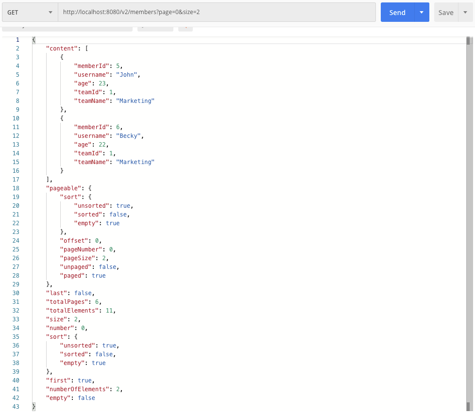

# querydsl과 페이징을 접목한 컨트롤러 예제

Spring Boot 에서는 컨트롤러에서 웹 요청에서 페이징 관련 파라미터를 스프링 데이터의 Pageable로 받을 수 있다.  

예를 들어 GET 요청이 아래와 같다고 해보자.  

> http://localhost:8080/v2/members?page=0&size=2  

  

그리고 컨트롤러의 예제는 아래와 같다.

```java
package com.study.qdsl.web.member;

// ...
@RestController
@RequiredArgsConstructor
public class MemberController {
	private final MemberJpaQdslRepository repository;
	private final MemberDataJpaRepository dataRepository;
  
	// ...
	
  @GetMapping("/v2/members")
	public Page<MemberTeamDto> getAllMember2(MemberSearchCondition condition, Pageable pageable){
		return dataRepository.searchPageSimple(condition, pageable);
	}
  
	// ...
  
}

```

이 경우 page, size는 Pageable의 page, size 멤버 필드에 값이 직접 대입된다. (이렇게 되는 원리가 커맨드 패턴 때문이었는지, internal view resolver 덕분이었는지 기억이 잘 안난다. 관련해서 정리해야 할 듯하다.) 

디버깅한 내용을 직접 스크린샷으로 확인해보자


  

위에서는 MemberDataJpaRepository 를 생성자를 통한 의존성 주입으로 의존성을 부여받았다. MemberDataJpaRepository에는 지금까지 작성한 페이징 연동 querydsl 코드가 있다.


리턴 결과를 확인해보자 (포스트맨 캡처화면이다.)



  

설명 더 정리... 오늘은 이만...