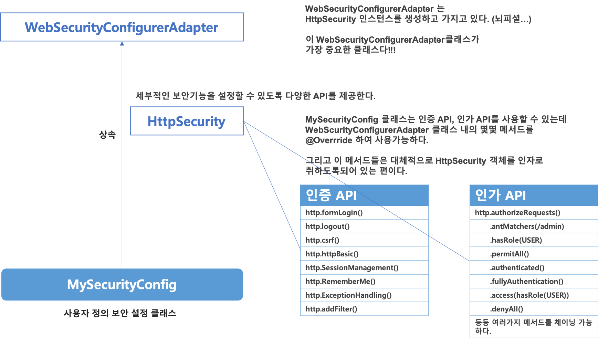
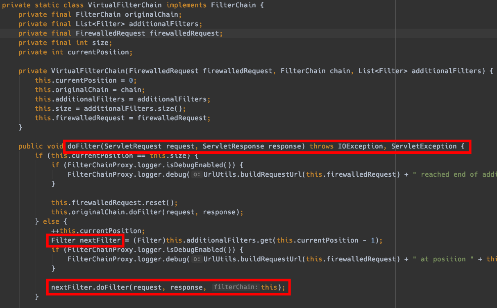
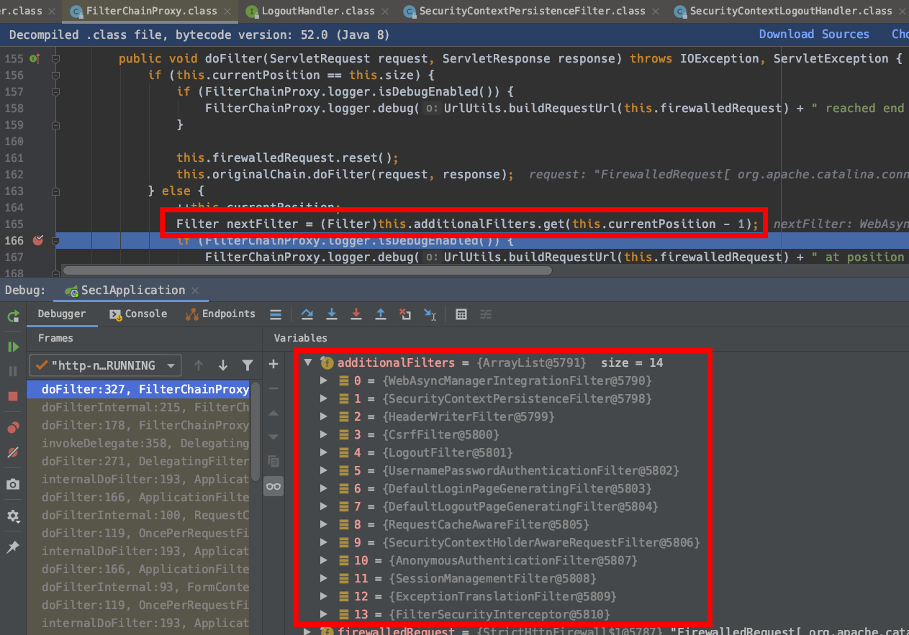
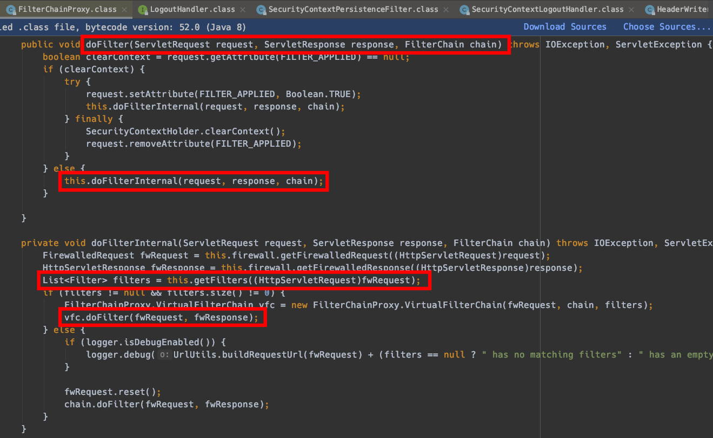
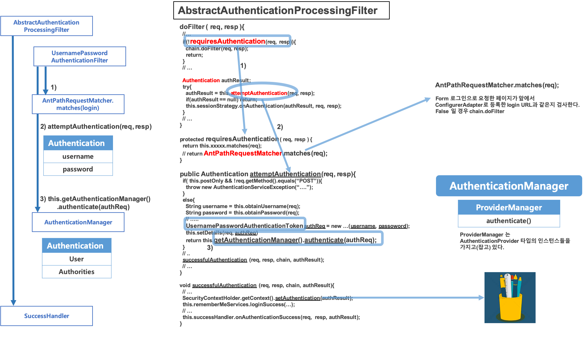
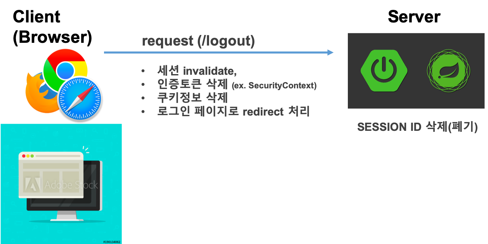
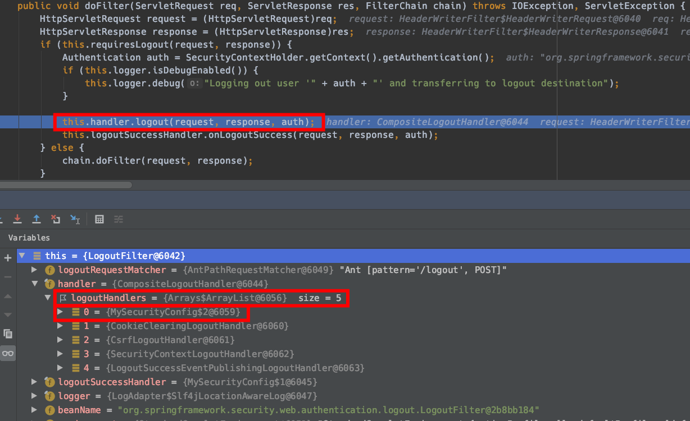
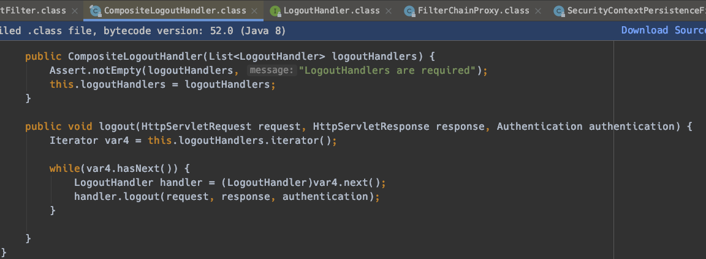
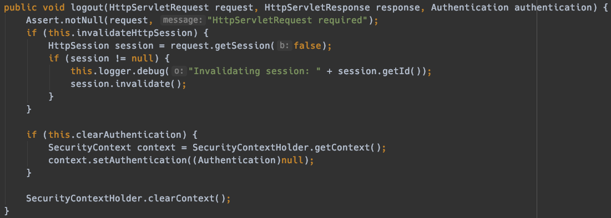

# 스프링 시큐리티 기초 (1) 

참고) 예제로 사용할 환경은 Spring Boot 기반으로 작성함. Spring 설정을 일일히 맞춰가면서 하기에는 시간이 너무 많이 걸리기 때문이다.  

 

# 1. 의존성 추가

## pom.xml

```xml
<dependency>
  <groupId>org.springframework.boot</groupId>
  <artifactId>spring-boot-starter-security</artifactId>
</dependency>
```


## 의존성 추가 후의 자동으로 제공되는 동작

메이븐 라이브러리 추가 후 re import 하고나면 아무런 작업을 하지 않아도, 서버를 구동시키고 나면 시큐리티의 초기화/보안설정 작업이 모두 마무리 된다.  

- 모든 요청은 인증이 되어야 자원에 접근이 가능하다.
- 제공되는 로그인 방식
  - 폼 로그인 방식
  - http Basic 방식
- 기본 로그인 페이지가 jar 파일 내에서 기본 제공된다.
- 디폴트로 제공되는 계정이 있다.
  - username 
    - user
  - password
    - 랜덤으로 생성한 문자열


# 2. WebSecurityConfigurerAdapter

WebSecurityConfigurerAdapter 클래스는 스프링 시큐리티를 처음 공부할 때 가장 기본이 되는 클래스이다. 이 클래스를 상속받은후 몇 가지의 메서드(configure() 등등)들을 @Override 하여 사용하는 편이다.   

보통 Security 설정을 할때 WebSecurityConfigurerAdapter 클래스를 상속받아 사용하는 편이다. WebSecurityConfigurerAdapter 클래스 내에서 필요한 메서드를 골라서 요구사항에 맞도록 선택하여 오버라이딩 할 수 있다. 

처음으로 시큐리티 설정을 작성할때 제일 처음 접하는 클래스는 HttpSecurity 클래스이다. HttpSecurity 클래스는  굉장히 다양한 기능을 제공한다. 종류에 따라 API를 분류하면 

- 인증 API
- 인가 API

로 나눌수 있다.  




# 3. FilterChainProxy

FilterChainProxy 클래스를 IDE에서 Shift + Shift 로 찾아서 들어가보자.  

FilterChainProxy 클래스의 doFilter(req, resp) 메서드에 Break Point 를 찍어서 확인해보면, localhost:8080 으로 접속할 때 브라우저에서 request를 날린 시점에 FilterChainProxy 클래스의 doFilter 클래스를 들르게 된다.  

FilterChainProxy 클래스에는 내부 클래스(inner class)로 VirtualFilterChain 클래스를 선언하고 있다.  

이 VirtualFilterChain 클래스는 아래와 같은 모양새이다.  



VirtualFilterChain 클래스 내의 doFilter (req, resp) 메서드 내에서 nextFilter.doFilter(req, resp, VirtualFilterChain) 을 호출하고 있다.  

이 부분을 디버그 모드로 브레이크 포인트를 찍어서 

- nextFilter
- additionalFilters

 라는 로컬 필드가 어떤 필드인지 확인해보자.



additionalFilters가 가지고 있는 필터들의 목록들을 보면 14개의 필터들을 가지고 있는 것을 확인할 수 있다. 현재 페이지에서는 이 필터들 모두를 다루기에는 한계가 있다. 여기서는 이렇게 많은 Filter들을 사용하고 있다는 것을 위에서 내려다 볼수 있다는 것에 만족하고 넘어가자.  

  

VirtualFilterChain 클래스의 doFilter를 어디서 호출하는지 궁금해질수 있다. 이 내용에 대해서는 아래에 캡처로 남겨두었다. FilterChainProxy 클래스 내에서 doFilter(req, resp, FilterChain chain) 메서드 내에서 doFilterInternal 을 호출하고 있다. 자세한 내용은 이 페이지에서 설명하기엔 너무 길다. FilterChainProxy만을 따로 정리하는 곳에서 설명할 예정이다.  

  

이 FilterChainProxy 내의 doFilter(req, resp, filterChain) 는 브라우저에서 localhost:8080 으로 request를 하면, 이 doFilter(req, resp, filterChain) 으로 들르게 된다. 이 doFilter(req, resp, filterChain) 내에서는 this.doFilterInternal(req, resp, chain)을 호출한다.




# 4. 스프링 시큐리티 필터들

스프링 시큐리티가 기본으로 제공하는 필터들은 약 14개이다. (캡처화면 추가하자~)  

방금전 확인해본 필터는 UsernamePasswordAuthenticationFilter 이다.  

정리정리열매...


# 5. UsernamePasswordAuthenticationFilter   




# 6. LogoutFilter

## 1) HttpSecurity::logout() 

HttpSecurity.logout() 함수는 로그아웃 기능에 대해 세부적인 설정들을 하는 메서드이다.


## 2) logout 시의 동작

### Overview




### LogoutFilter - CALL-FLOW


  

### LogoutFilter 내의 handler 필드가 가지고 있는 여러가지 handler들

디버그 모드로 LogoutFilter 클래스의 doFilter(req, res, FilterChain)을 살펴보자.  

멤버변수 handler 에는 logoutHandlers 라는 List로 관리하고 있는 핸들러의 리스트를 확인 가능하다.  

그중 가장 첫번째로 등록된 것은 우리가 방금전 작성한 MySecurityConfig 클래스이다.  

MySecurityConfig 클래스에서 등록하고 있는 핸들러중 하나가 이곳에 등록된 것으로 보인다.  



  

그리고 이제 this.handler.logout (req, resp, auth) 구문에 대해서 Cmd + Opt + B 를 통해 정의된 구문으로 이동하려 하면 여러가지의 Handler가 뜨는데, 위의 그림에서 디버깅 코드 힌트로 보이듯이 CompositeLogoutHandler 의 logout 메서드가 실행되게 된다.



가지고 있는 모든 handler 들의 logout 함수를 실행시킨다. 멋지다!  


#### SecurityContextLogoutHandler

위에서 디버그 모드로 확인해본 handler 내의 logoutHandlers 내에서 SecurityContextLogoutHandler를 살펴보자. SecurityContextLogoutHandler의 logout(req, resp, auth) 메서드 내에서는

- session.invalidate();
- context.setAuthentication(null);
- SecurityContextHolder.clearContext();

를 수행하고 있다.




## 3) 예제

설명은 주석으로 정리

```java
	@Override
	protected void configure(HttpSecurity http) throws Exception {
		// ...
    
		http.logout()									// 로그아웃에 대한 기능정의를 시작한다.
			.logoutUrl("/logout")				// 로그아웃 요청을 받을 페이지의 url 은 "/logout" 이다.
			.logoutSuccessUrl("/login")	// logout후 리다이렉트 될 페이지는 "logout" 으로 지정한다.
      // LogoutHandler
			.addLogoutHandler(new LogoutHandler() {		// 로그아웃 동작시에 처리할 동작을 기술한다.
				@Override
				public void logout(	HttpServletRequest httpServletRequest,
									HttpServletResponse httpServletResponse,
									Authentication authentication) {
					HttpSession session = httpServletRequest.getSession();
					session.invalidate();
				}
			})
      // LogoutSuccessHandler
      // 로그아웃 후 리다이렉트 해 이동할 페이지를 지정하는 등의 동작을 지정한다.
			.logoutSuccessHandler(new LogoutSuccessHandler() {
				@Override
				public void onLogoutSuccess( HttpServletRequest httpServletRequest,
											 HttpServletResponse httpServletResponse,
											 Authentication authentication) throws IOException, ServletException {
					httpServletResponse.sendRedirect("/login");
				}
			})
      .deleteCookies("remember-me")
	}
```


## 4) LogoutFilter::doFilter (req, res, chain)

LogoutFilter 클래스의 doFilter 클래스이다.

```java
    public void doFilter(ServletRequest req, ServletResponse res, FilterChain chain) throws IOException, ServletException {
        HttpServletRequest request = (HttpServletRequest)req;
        HttpServletResponse response = (HttpServletResponse)res;
        if (this.requiresLogout(request, response)) {
            Authentication auth = SecurityContextHolder.getContext().getAuthentication();
            if (this.logger.isDebugEnabled()) {
                this.logger.debug("Logging out user '" + auth + "' and transferring to logout destination");
            }

            this.handler.logout(request, response, auth);
            this.logoutSuccessHandler.onLogoutSuccess(request, response, auth);
        } else {
            chain.doFilter(request, response);
        }
    }
```


## 참고) 세션 기본 개념


