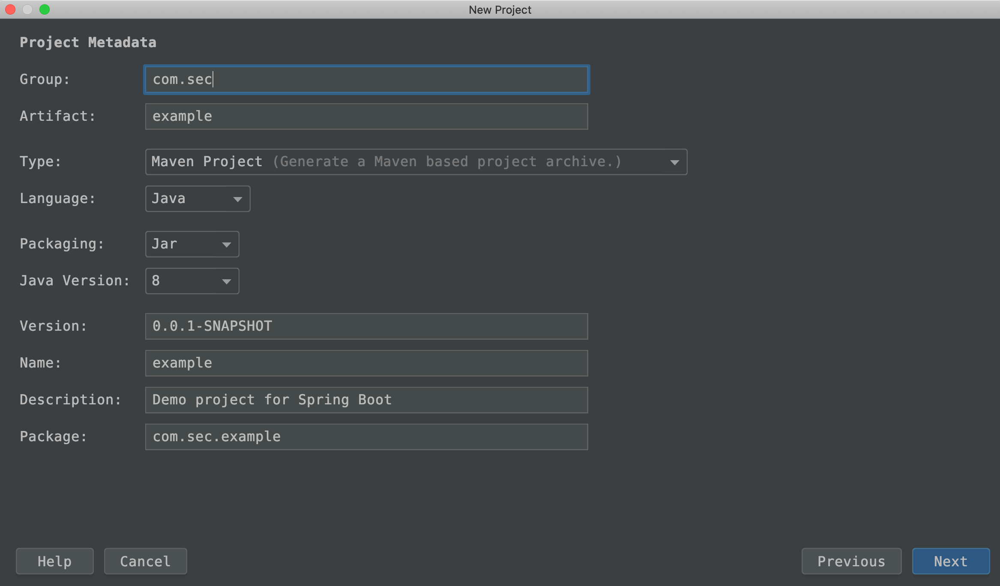

# Security 튜토리얼 (1)


# 1. 프로젝트 생성

이것 저것 다 귀찮다. 샘플 플젝이므로 Spring Initializr 를 사용했다.




# 2. 샘플 페이지 생성


## 뷰 페이지들 역할 

html 페이지를 세개 만들 예정이다.

- index.html

  - index.html 페이지는 루트 페이지

  - 여기서 

    - /home 
    - /welcome

    으로의 이동을 담당하는 a 태그를 생성해놓는다.

- home.html

  - 인증을 받은 사용자, 즉, 로그인 한 사용자만 접근 가능

- welcome.html

  - 인증을 받지 않아도, 모든 사용자가 접근할 수 있다.


## 의존성 추가

뷰단에서 thymeleaf를 사용할 것이므로 thymeleaf 의존성을 추가한다.

**pom.xml**

```xml
    <dependency>
      <groupId>org.springframework.boot</groupId>
      <artifactId>spring-boot-starter-thymeleaf</artifactId>
    </dependency>
```


## html 파일들

index.html  

(src/main/resources/templates/index.html)

```html
<!DOCTYPE html>
<html lang="en">
<head>
  <meta charset="UTF-8">
  <title>Index</title>
</head>
<body>
<h1>Index Page ... </h1>
<a href="/welcome">welcome </a>
&nbsp;&nbsp;
<a href="/home">Home</a>
</body>
</html>
```

home.html  

(src/main/resources/templates/home.html)

```html
<!DOCTYPE html>
<html lang="en">
<head>
  <meta charset="UTF-8">
  <title> Home </title>
</head>
<body>
<h1> 로그인 하셨군요!!! </h1>
</body>
</html>
```

welcome.html  

(src/main/resources/templates/welcome.html)

```html
<!DOCTYPE html>
<html lang="en">
<head>
  <meta charset="UTF-8">
  <title> WELCOME </title>
</head>
<body>
<h1> 환영합니다!!!  </h1>
</body>
</html>
```


# 3. Controller 추가

HomeController.java라는 이름으로 자바파일을 하나 생성하자. HomeController.java에 index, home, welcome 페이지들에 대한 RequestMapping을 추가해준다.

```java
package com.sec.example.web;

import org.springframework.stereotype.Controller;
import org.springframework.web.bind.annotation.GetMapping;

@Controller
public class HomeController {

	@GetMapping("/")
	public String index(){
		return "index";
	}

	@GetMapping("/home")
	public String home(){
		return "home";
	}

	@GetMapping("/welcome")
	public String welcome(){
		return "welcome";
	}
}
```


# 4. Security 의존성 추가

```xml
    <dependency>
      <groupId>org.springframework.boot</groupId>
      <artifactId>spring-boot-starter-security</artifactId>
    </dependency>
```


톰캣을 구동시켜보자. http://localhost:8080 에 접속하면 기본 로그인 페이지가 나타난다.


별다른 작업(login 페이지에 대한 requestMapping, login 페이지 html 추가 등등)을 하지 않으면 target에 지정된 login.html 페이지를 출력한다. 자동 설정에 되있는 것으로 보인다.  
  

별다른 작업 없이도, spring-security 의존성을 추가했을 때 @SecurityAutoConfiguration 에 의해 모든 url 요청에 대해 인증을 수행하게 된다.  
(@SecurityAutoConfiguration -> @SpringBootWebSecurityConfiguration -> @WebSecurityConfigurerAdapter -> WebSecurityConfigurerAdapter::configure(HttpSecurity http))

# 5.Security 설정

SecurityConfig.java

```java
package com.sec.example.config;

import org.springframework.context.annotation.Configuration;
import org.springframework.security.config.annotation.web.builders.HttpSecurity;
import org.springframework.security.config.annotation.web.configuration.WebSecurityConfigurerAdapter;

@Configuration
public class SecurityConfig extends WebSecurityConfigurerAdapter {

	@Override
	protected void configure(HttpSecurity http) throws Exception {
		http.authorizeRequests() 	// http 요청을 Authorizing 하겠다.
				// Authorizing 할때 AntMatcher로 /, /welcome은 허용하겠다.
				.antMatchers("/", "/welcome").permitAll()
				// 그 외의 어떤 요청이든 Authorizing(인증)을 하겠다.
				.anyRequest().authenticated()
			.and() // 세부설정을 하고 난 후 다시 HttpSecurity 객체를 받아오기 위한 and 구문
				.formLogin()	
			.and() // 세부설정을 하고 난 후 다시 HttpSecurity 객체를 받아오기 위한 and 구문
				.httpBasic();
	}
}

```

여기까지는 

- welcome.html
- index.html 

페이지는 로그인 없이 접속 가능하다.


# 6. 기본 jpa 로직 추가

## 의존성 추가(h2, data-jpa)

```xml
    <dependency>
      <groupId>org.springframework.boot</groupId>
      <artifactId>spring-boot-starter-data-jpa</artifactId>
    </dependency>

    <dependency>
      <groupId>com.h2database</groupId>
      <artifactId>h2</artifactId>
    </dependency>
```


## Entity, Repository

### Entity

UserModel라는 이름의 클래스를 생성하고 Entity로 등록하자.

```java
package com.sec.example.auth;

import javax.persistence.Entity;
import javax.persistence.GeneratedValue;
import javax.persistence.Id;

@Entity
public class UserModel {

	@Id @GeneratedValue
	private Long id;

	private String username;

	private String password;

	public Long getId() {
		return id;
	}

	public void setId(Long id) {
		this.id = id;
	}

	public String getUsername() {
		return username;
	}

	public void setUsername(String username) {
		this.username = username;
	}

	public String getPassword() {
		return password;
	}

	public void setPassword(String password) {
		this.password = password;
	}
}
```


### Repository

UserModelRepository.java

```java
package com.sec.example.auth;

import java.util.Optional;
import org.springframework.data.jpa.repository.JpaRepository;

public interface UserModelRepository extends JpaRepository<UserModel, Long> {

	Optional<UserModel> findByUsername(String username);
}

```


# 7. UserDetailService 구현

- @Service 어노테이션이 있으면서
- UserDetailsService를 implements한 

클래스가 존재하면, 스프링 부트의 시큐리티 자동 설정을 거치지 않고 우리가 구현한 시큐리티 로직을 타게 된다.  

UserDetailsService 인터페이스에는 

- loadUserByUsername(String username)

이라는 메서드가 존재한다. 이 메서드를 구현해주면, 인증 요청 발생시 SecurityConfig에서 UserDetailsService 타입의 클래스인  UserAuthService를 찾아 loadUserByUsername을 실행한다.


1. loadUserByUsername을 구현
2. createUser() 메서드 생성


**UserAuthService.java**

```java
package com.sec.example.auth;

import java.util.Arrays;
import java.util.List;
import java.util.Optional;
import org.springframework.beans.factory.annotation.Autowired;
import org.springframework.security.core.authority.SimpleGrantedAuthority;
import org.springframework.security.core.userdetails.User;
import org.springframework.security.core.userdetails.UserDetails;
import org.springframework.security.core.userdetails.UserDetailsService;
import org.springframework.security.core.userdetails.UsernameNotFoundException;
import org.springframework.stereotype.Service;

@Service
public class UserAuthService implements UserDetailsService {

	@Autowired
	private UserModelRepository userModelRepository;

	@Override
	public UserDetails loadUserByUsername(String username) throws UsernameNotFoundException {
		Optional<UserModel> user = userModelRepository.findByUsername(username);
		UserModel matchedUserModel = user.orElseThrow(()->new UsernameNotFoundException(username));

		String matchedUserName = matchedUserModel.getUsername();
		String matchedUserPw = matchedUserModel.getPassword();

		List<SimpleGrantedAuthority> authorities
			= Arrays.asList(new SimpleGrantedAuthority("ROLE_USER"));

		return new User(matchedUserName, matchedUserPw, authorities);
	}

	public UserModel createUser(String username, String password){
		UserModel userModel = new UserModel();
		userModel.setUsername(username);
		userModel.setPassword(password);
		return userModelRepository.save(userModel);
	}

}
```


# 8. 샘플 유저 생성

사용자가 있는지 없는지 확인후 인가를 해줄지 결정하는 로직이 필요하다. 사용자가 있어야 인가작업에 대한 확인을 할 수 있다. 따라서 샘플 유저를 생성하는데, 실 DB를 미리 세팅하기에는 글이 너무 길어진다. 따라서 Java에서 직접 생성해 테스트해보자.  


**FakeUserModelRunner.java**

```java
package com.sec.example.config;

import com.sec.example.auth.UserAuthService;
import com.sec.example.auth.UserModel;
import org.springframework.beans.factory.annotation.Autowired;
import org.springframework.boot.ApplicationArguments;
import org.springframework.boot.ApplicationRunner;
import org.springframework.stereotype.Component;

@Component
public class FakeUserModelRunner implements ApplicationRunner {

	@Autowired
	UserAuthService userAuthService;

	@Override
	public void run(ApplicationArguments args) throws Exception {
		UserModel userModel = userAuthService.createUser("elephant", "1111");
		System.out.println(userModel.getUsername() + ", " + userModel.getPassword());
	}
}
```

여기 까지 진행했더라도 로그인이 잘 안된다. 패스워드 인코딩으로 DB에 저장해야 한다. 

# 9. PasswordEncoder

1. PasswordEncoder를 생성하는 빈 추가  
2. UserAuthService 내의 저장로직 수정  
   UserAuthService 내에 UserModel 저장시 Encode해 저장하도록 수정

### 1. PasswordEncoder 생성하는 빈 추가

```java
package com.sec.example.config;

import org.springframework.context.annotation.Bean;
import org.springframework.context.annotation.Configuration;
import org.springframework.security.config.annotation.web.builders.HttpSecurity;
import org.springframework.security.config.annotation.web.configuration.WebSecurityConfigurerAdapter;
import org.springframework.security.crypto.factory.PasswordEncoderFactories;
import org.springframework.security.crypto.password.PasswordEncoder;

@Configuration
public class SecurityConfig extends WebSecurityConfigurerAdapter {
  // ... 

  // 이 부분이 추가되었다.
	@Bean
	public PasswordEncoder passwordEncoder(){
		return PasswordEncoderFactories.createDelegatingPasswordEncoder();
	}
}
```


### 2. UserAuthService 내의 저장로직 수정

```java
package com.sec.example.auth;

import java.util.Arrays;
import java.util.List;
import java.util.Optional;
import org.springframework.beans.factory.annotation.Autowired;
import org.springframework.security.core.authority.SimpleGrantedAuthority;
import org.springframework.security.core.userdetails.User;
import org.springframework.security.core.userdetails.UserDetails;
import org.springframework.security.core.userdetails.UserDetailsService;
import org.springframework.security.core.userdetails.UsernameNotFoundException;
import org.springframework.security.crypto.password.PasswordEncoder;
import org.springframework.stereotype.Service;

@Service
public class UserAuthService implements UserDetailsService {

	@Autowired
	private UserModelRepository userModelRepository;

  // 빈으로 등록한 PasswordEncoder 주입
	@Autowired
	private PasswordEncoder passwordEncoder;

	// ...
  
	public UserModel createUser(String username, String password){
		UserModel userModel = new UserModel();
		userModel.setUsername(username);
		userModel.setPassword(passwordEncoder.encode(password)); // 이 부분이 변경되었다.
		return userModelRepository.save(userModel);
	}

}
```


# 10. 로그인 확인

로그인을 해보자. FakeUserApplicationRunner로 생성한

- elephant
- 1111

로 로그인 하면 된다.  

아래와 같은 페이지가 나온다면 성공이다.


# 11. 다음 계획

- 시큐리티_튜토리얼2에서는 
  - 회원가입 페이지, 회원 추가 로직
    - 회원가입 페이지는 welcome에 추가할 생각이다.
    - 필요하다면 welcome.html, url 매핑을 바꿀생각
- 시큐리티_튜토리얼3 에서는 
  - 로그인 페이지 (/login), 로그인 요청 커스터마이징

를 만들어볼계획이다.  

이후에는 딱히 정해진 계획은 아니지만 생각해보는 것들은 

- 로그인 페이지에서 인증요청 보낼때의 보안방식 고려
- jwt 인증 해보기

를 해볼 생각이다.

