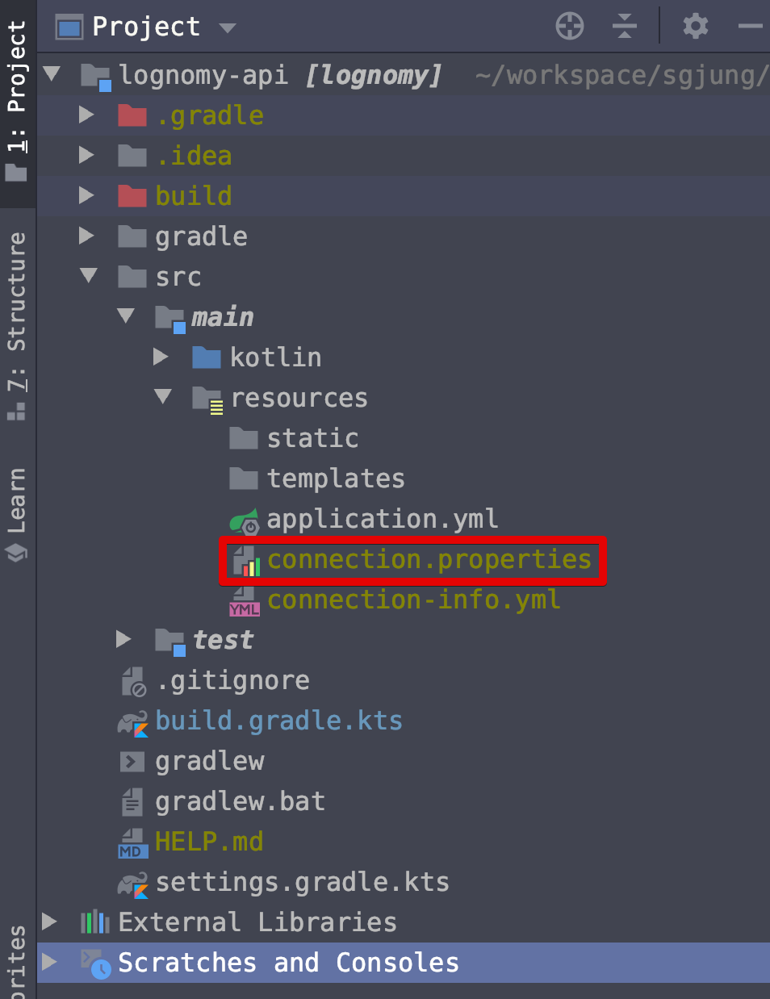
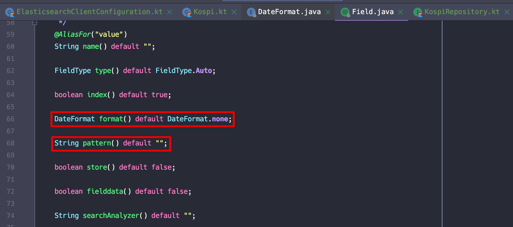
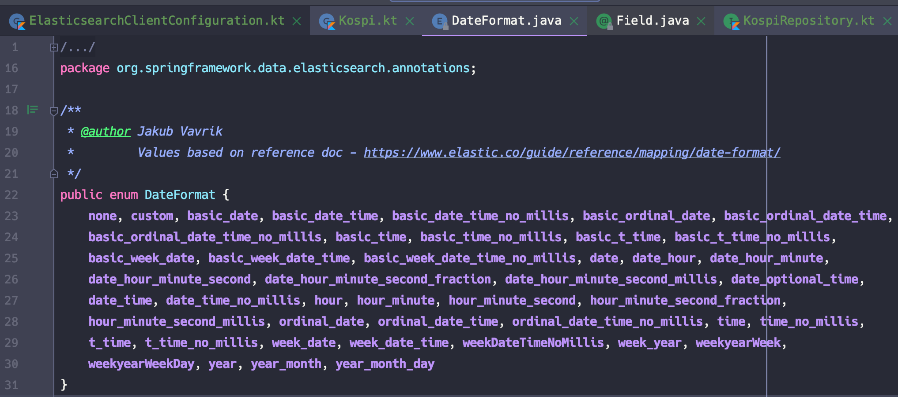
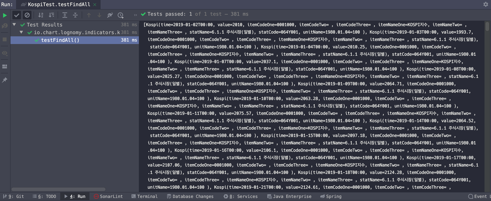

# ElasticSearch 내의 KOSPI 데이터 조회 (feat. Spring Data ElasticSearch)
> [velog 문서](https://velog.io/@gosgjung/chartnomy-ElasticSearch-%EB%82%B4%EC%9D%98-KOSPI-%EA%B2%BD%EC%A0%9C%EC%A7%80%ED%91%9C-%EC%A1%B0%ED%9A%8C-feat.-Spring-Data-ElasticSearch) 에 게시한 글. git을 통해 버전관리중!!

이번 글에서는 Elastic Search 를 Spring Data Elasticsearch에 연동하는 과정을 다뤄보려 한다. 사용한 프로그래밍 언어는 Kotlin 이다.  


## 주의할 점
- connection 정보를 담고있는 yml 또는 properties 파일을 버전관리되지 않도록 보호해야 한다.
  - 회사 내부에서만 관리되는 버전관리 시스템이라면 굳이 신경쓸 필요는 없을지도 모르겠다.
  - public 리포지터리에 공개하는 것이라면 해당 properties/yml 파일을 gitignore로 등록해두어야 한다.
  - 비트코인 채굴 및 악성 봇에 악용될 소지가 있기 때문이다.
- https://, http:// 와 같은 접두사를 접속정보에서 제거할 것
  - [https://stackoverflow.com/questions/62552911/unable-to-connect-my-java-application-to-the-elastic-stack-instance](https://stackoverflow.com/questions/62552911/unable-to-connect-my-java-application-to-the-elastic-stack-instance)  
  - ex) 예를 들면, 사용가능한 elasticsearch 의 host의 URL은 아래와 같다.
    - a2580127b5fa47a783245a38d16c6a76.ap-northeast-2.aws.elastic-cloud.com

# Elastic Cloud 접속정보 설정
connection.properties 라는 파일을 생성해서 이곳에 모든 외부 서버의 접속정보들을 모아둘 예정이다. 프로젝트의 구조는 아래와 같다. gititnore로 등록해둔 상태이다.
  

이 connection.properties 파일에는 아래와 같은 접속정보들을 입력해두었다.  
주의할 점은 https://, http:// 와 같은 접두사(scheme)을 URL에서 제거한 문자열을 ElasticSearch 의 host 로 사용해야 Elastic Search High Level Client 라는 라이브러리와 정상적으로 연동된다.  

> 참고 : [stack over flow](https://stackoverflow.com/questions/62552911/unable-to-connect-my-java-application-to-the-elastic-stack-instance)  


ex) connection.properties
```properties
# rds 접속 정보 등등…

# TODO 정리 필요 https:// 또는 http:// 를 제거해야 한다.
# https://stackoverflow.com/questions/62552911/unable-to-connect-my-java-application-to-the-elastic-stack-instance

# 이건 잘못된 주소 형식이다. https:// 를 제거하자
# conn.elasticsearch.host=https://f765633ef8c84c4a9fb0b0f8f24ad84d.ap-northeast-2.aws.elastic-cloud.com
# http:// 를 제거한 문자열을 java config 시 사용해야 한다. (ElasticSearch 라이브러리 내부에서 통용되는 형식이라 조금 어쩔수 없는 부분)
conn.elasticsearch.host=f765633ef8c84c4a9fb0b0f8f24ad84d.ap-northeast-2.aws.elastic-cloud.com

conn.elasticsearch.port=9243
conn.elasticsearch.cluster_name=a2580127b5fa47a783245a38d16c6a76
conn.elasticsearch.username=elastic
conn.elasticsearch.password=ZMDnxlVzyQkGQwrYDOh9nkl9


spring.main.allow-bean-definition-overriding=true
```

# PropertySourceConfig
스프링 로딩시 src/main/resources 밑의 connection.properties 파일을 읽어들이도록 아래와 같이 명시적으로 설정해주었다.
```kotlin
package io.chart.lognomy.config


import org.springframework.context.annotation.Configuration
import org.springframework.context.annotation.PropertySource


@Configuration
@PropertySource("classpath:/connection.properties")
class PropertySourceConfig {
}
```

# ElasticSearchConfig
ElasticSearch 를 설정하는 파일은 아래와 같다. 아직은 단순 설정만 적용된 상태이긴 하지만, 추후 Reactive Programming 방식으로 변경 예정이다.

> 참고자료
> - [docs.spring.io - elasticsearch.clients.rest](https://docs.spring.io/spring-data/elasticsearch/docs/current/reference/html/#elasticsearch.clients.rest)
> - Unknown Host Exception 에러 발생 관련해서 참고한 자료
>   - 검색어 : `search.core.ElasticsearchRestTemplate.translateException`
>   - [unknown host exception using java client](https://discuss.elastic.co/t/java-net-unknownhostexception-using-java-rest-client-5-6-3/106329)

```kotlin
package io.chart.lognomy.config


import org.apache.http.Header
import org.apache.http.message.BasicHeader
import org.elasticsearch.client.RestHighLevelClient
import org.springframework.beans.factory.annotation.Value


import org.springframework.context.annotation.Bean
import org.springframework.context.annotation.Configuration
import org.springframework.data.elasticsearch.client.ClientConfiguration
import org.springframework.data.elasticsearch.client.RestClients
import org.springframework.data.elasticsearch.config.AbstractElasticsearchConfiguration
import org.springframework.data.elasticsearch.repository.config.EnableElasticsearchRepositories
import org.springframework.http.HttpHeaders
import java.time.Duration
import java.util.*


/*
    TODO 정리 필요
    cluster name 을 얻어오는 방식은 https://www.elastic.co/guide/en/elasticsearch/reference/current/cluster-state.html 에 자세히 설명되어 있다.
    이 중 curl -X GET "localhost:9200/_cluster/state/blocks?pretty" 을 선택했다.
 */


//@EnableElasticsearchRepositories
@Configuration
class ElasticsearchClientConfiguration (
        @Value("\${conn.elasticsearch.host}") val host: String,
        @Value("\${conn.elasticsearch.port}") val port: String,
        @Value("\${conn.elasticsearch.cluster_name}") val clusterName: String,
        @Value("\${conn.elasticsearch.username}") val username: String,
        @Value("\${conn.elasticsearch.password}") val password: String
) : AbstractElasticsearchConfiguration() {


    // AbstractElasticsearchConfiguration 클래스 내에 abstract 메서드에서, 반드시 implements 해야 한다.
    // 이런점은 확실히 마음에 든다.
    @Bean
    override fun elasticsearchClient(): RestHighLevelClient {
        val hostAndPort = "$host:$port"


        // java.net.UnknownHostException elasticsearch 검색내용
        // https://discuss.elastic.co/t/java-net-unknownhostexception-using-java-rest-client-5-6-3/106329/17
        // https://discuss.elastic.co/t/java-net-unknownhostexception-using-java-rest-client-5-6-3/106329/18
        // https://discuss.kotlinlang.org/t/how-to-call-string-getbytes/2152
        val encodedBytes : String = Base64.getEncoder().encodeToString("$username:$password".toByteArray())
//        val headers = mutableListOf<Header>()
//        headers.add(BasicHeader(HttpHeaders.CONTENT_TYPE, "application/json"))
//        headers.add(BasicHeader("Authorization", "Basic $encodedBytes"))


        val httpHeaders: HttpHeaders = HttpHeaders()
        httpHeaders.add("Content-Type", "application/json");
        httpHeaders.add("Authorization", "Basic $encodedBytes")


        val clientConfiguration : ClientConfiguration = ClientConfiguration.builder()
                .connectedTo(hostAndPort)
                .usingSsl()
                .withConnectTimeout(Duration.ofSeconds(5))
                .withSocketTimeout(Duration.ofSeconds(5))
                .withDefaultHeaders(httpHeaders)
//                .withBasicAuth(username, password)
//                .usingSsl()
//                .withProxy("asdf")
//                등등 굉장히 많은 설정이 있다.
//                자세한 내용은 아래 링크 참고
//                https://docs.spring.io/spring-data/elasticsearch/docs/current/reference/html/#elasticsearch.clients.configuration
                .build()


        return RestClients.create(clientConfiguration).rest()
    }

}
```

# Entity
> 참고자료
>
> - [doc.spring.io - elasticsearch.mapping.meta-model.annotations](https://docs.spring.io/spring-data/elasticsearch/docs/current/reference/html/#elasticsearch.mapping.meta-model.annotations)

그리고 ISO Format 형식의 시간 문자에 대한 포맷 역시 확인해야 했기에 아래의 자료 역시 참고했다.
- [mapping data format](https://www.elastic.co/guide/en/elasticsearch/reference/current/mapping-date-format.html)

## 엔티티 매핑
@Field 안에서 format, pattern 이 어떤 Java의 어떤 데이터 타입인지 공식문서에 나와있지 않아서 잠깐 막막했었다. 그래서 @Field 어노테이션 내부구현을 참고해본 결과 아래와 같은 요소들을 사용해서 구현하게 되었다.  

- format() : DateFormat 
  - org.springframework.data.elasticsearch.annotations.DateFormat
  - 이 DateFormat 은 enum 타입이다.
- pattern() : String

날짜 format, pattern 을 지정해주는 @Field 내부 구현을 살펴보자


  



  

## Kospi 엔티티 매핑

**Kospi.kt**
```kotlin
package io.chart.lognomy.indicators.kospi


import org.springframework.data.annotation.Id
import org.springframework.data.elasticsearch.annotations.DateFormat
import org.springframework.data.elasticsearch.annotations.Document
import org.springframework.data.elasticsearch.annotations.Field
import org.springframework.data.elasticsearch.annotations.FieldType
import java.time.LocalDateTime


// 참고자료
// https://docs.spring.io/spring-data/elasticsearch/docs/current/reference/html/#elasticsearch.clients.rest


@Document(indexName = "kospi", createIndex = false)
data class Kospi(
        @Id @Field(name = "TIME", type = FieldType.Date, pattern = "yyyy-MM-dd'T'hh:mm:ss", format = DateFormat.date_hour_minute_second)
        val time : LocalDateTime,


        @Field(name = "DATA_VALUE", type = FieldType.Text) val value: String,
        @Field(name = "ITEM_CODE1", type = FieldType.Text) val itemCodeOne : String,
        @Field(name = "ITEM_CODE2", type = FieldType.Text) val itemCodeTwo : String,
        @Field(name = "ITEM_CODE3", type = FieldType.Text) val itemCodeThree : String,
        @Field(name = "ITEM_NAME1", type = FieldType.Text) val itemNameOne : String,
        @Field(name = "ITEM_NAME2", type = FieldType.Text) val itemNameTwo : String,
        @Field(name = "ITEM_NAME3", type = FieldType.Text) val itemNameThree : String,
        @Field(name = "STAT_NAME", type = FieldType.Text) val statName : String,
        @Field(name = "STAT_CODE", type = FieldType.Text) val statCode : String,
        @Field(name = "UNIT_NAME", type = FieldType.Text) val unitName : String
)
```

  

# Repository, Service

Repository, Service의 내용은 Elastic Search의 내용을 참고할 내용이 많지 않기 때문에 크게 어렵거나 막히는 내용은 없을듯 하다.  


## Repository
**KospiRepository.kt**

```kotlin
package io.chart.lognomy.indicators.kospi

import org.springframework.data.elasticsearch.repository.ElasticsearchRepository
import org.springframework.data.repository.Repository

import java.time.LocalDateTime

// 일부 인터넷 자료를 보면 아래 주석친 부분과 같은 내용들이 나오는데, 현재 시점의 최신버전인 ElasticSearch 7.x 에서는 통하지 않는다.
// Jackson 등과 같은 라이브러리 지원 등을 제거하면서 대폭 바뀌었기 때문이다.
//@Repository("kospiRepository")
//interface KospiRepository : ElasticsearchRepository<Kospi, LocalDateTime>{

// 이게 정상적으로 동작하는 코드이다. 빌트인(??)으로 제공되는 spring data jpa 를 가져다 쓰면 된다.
interface KospiRepository : Repository<Kospi, LocalDateTime> {
    fun findAllBy(): List<Kospi>
}
```

  

## Service

**KospiService.kt**

```kotlin
package io.chart.lognomy.indicators.kospi

import org.springframework.stereotype.Service

@Service
class KospiService (
        val kospiRepository: KospiRepository
){
    public fun findAll(): List<Kospi> {
        return kospiRepository.findAllBy().toList()
    }
}
```

  

# 테스트 코드

대망의 테스트 코드~  

  

## KospiTest.kt

```kotlin
package io.chart.lognomy.indicators.kospi


import org.junit.jupiter.api.BeforeEach
import org.junit.jupiter.api.DisplayName
import org.junit.jupiter.api.Test
import org.springframework.beans.factory.annotation.Autowired
import org.springframework.beans.factory.annotation.Qualifier
import org.springframework.boot.test.context.SpringBootTest


@SpringBootTest
class KospiTest {


    lateinit var kospiService: KospiService


    @Qualifier("kospiRepository")
    @Autowired
    lateinit var kospiRepository: KospiRepository


    @BeforeEach
    fun setup() : Unit{
        kospiService = KospiService(kospiRepository)
    }


    @Test
    @DisplayName("findAll")
    fun testFindAll() : Unit{
        val findAll = kospiService.findAll()
        println(findAll)
    }
}
```

  

## 출력결과

잘 된다~ 😅😅  


  

# 마치면서 💾

아직 ELK를 실무에서 사용해본 경험은 없다. 전 회사에서 다뤄본 에너지 모니터링 시스템의 데이터를 빠르게 처리하는 것을 더 빠르게 처리할 수 있는 시스템을 만들어보는게 나의 호기심영역이다. 이런 이유로... 실제 운영되는 에너지 데이터는 일반인의 신분으로 구할 수는 없기 때문에 에너지 데이터처럼 시간축을 기반으로 하는 경제지표 데이터를 구하게 되었다. 경제지표 데이터 (미국 기준금리, 한국 기준금리, 원/달러 환율, 위안화/달러 환율)에 대해 여러가지 시도를 chartnomy 프로젝트를 진행해보면서 여러가지 기술들을 접해보면서 내가 가진 기술력을 스케일업해나갈 생각이다.

이런 생각으로 제일 처음으로 관심을 가지게 된 기술은 Elastic Search 였다. Index를 생성하고 관리하는 것부터 덤프 Data 를 밀어넣는 것, Spring 에서 조회하는 것까지... 여러가지로 공부할 게 많지만, 뭔가 게임을 해나가는 과정과 같은 기분이어서 재미있기는 하다. 뭔가 퀘스트가 있는 게임을 하는 기분이다. 그런데... 가끔은 등산도 하고 컴퓨터를 끄고 나가서 땀을 흘리는 시간도 가져야 할것 같다. 등산을 너무 하고 싶다 😅