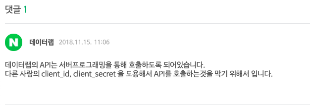
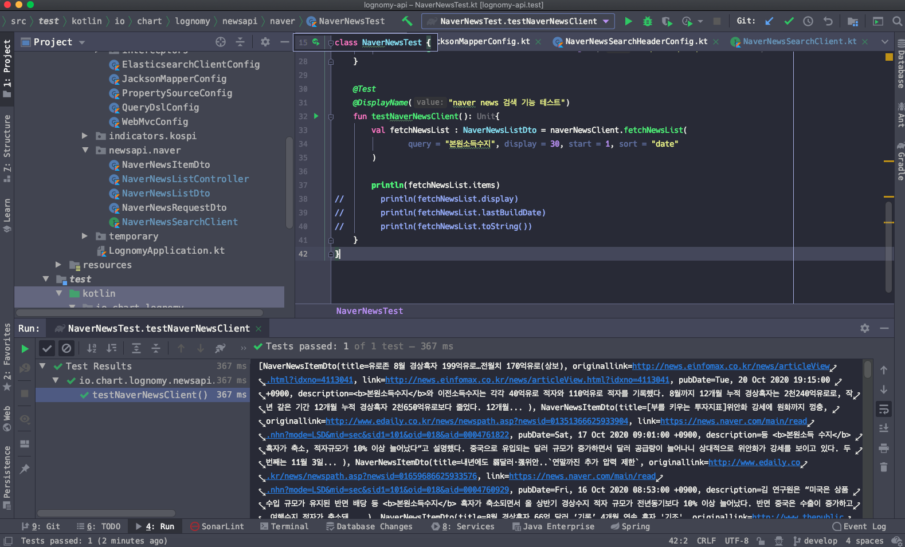

# Open Feign을 이용해 네이버 검색 API 연동하기

> velog 에 게시할 내용을 미리 작성하고, velog의 내용을 백업으로 남겨놓기 위해 github repository에 정리.


lognomy 클라이언트 기능에는 뉴스 키워드 검색을 활용할 예정이고, React 기반으로 뉴스 뷰어를 구현했다. React 클라이언트 내에서 axios를 이용해 네이버 검색 API를 사용할때 CORS 관련 에러를 접했었다. 이유는 Client Id, Client Secret을 이용해서 javascript 단에서 단독으로 통신하는 것이 불가능한데... 서버 내에서 클라이언트에 데이터를 내려줄 때 response header 에 특정 헤더를 포함해주어야 React 클라이언트에서 접근이 가능하도록 open api의 정책이 정해져 있기 때문이다.

  

네이버에서는 이에 대해 아래와 같이 설명하고 있다. Client Id, Client Secret이 상용페이지의 javascript 내에서 그대로 header 에 담겨서 왔다갔다하는 소스를 악용하는 사람들이 많았던것 같다. 이런 이유에서인지 서버단에서 네이버 검색 API를 사용하도록 유도하는 것으로 보였다.  




React 를 이용해 예제를 만드는 것이 목적이라면 위의 문제를 해결하는 방법은 두가지 이다.

- Web pack 설정을 통해 개발 버전에서만 Dev Server에 특정 옵션을 주거나, proxy를 경유하도록 지정하는 것
- 서버 프로그래밍을 해주는 것
  - 나의 경우는 node.js 보다는 spring boot가 더 쉽다. 이런 이유로 spring을 활용해서 예제를 작성했다.
  - 나중에 기회가 된다면 node.js를 이용해서도 해볼까 생각중이긴 하다...


위에서 설명했듯이 Spring Boot 앱위에 아래의 기능을 구현하는 것으로 이 내용을 해결했다.

해당 변경사항에 대한 소스코드는 아래를 참고하자.

# 소스코드 URL

- [소스 코드 URL](https://github.com/soongujung/lognomy)
- [해당 변경 버전 URL](https://github.com/soongujung/lognomy/commit/dbf95b6f2b2a43c0592d6bb018f0d2e45bd3c4a7)


# 네이버 OPEN API 문서

- [네이버 개발자센터](https://developers.naver.com/main/) 
- [네이버 개발자 API 애플리케이션 리스트 - 내가 등록한 앱 확인하기](https://developers.naver.com/apps/#/list)  
- [네이버 뉴스 검색 API 문서](https://developers.naver.com/docs/search/news/)


# Lognomy 클라이언트

- [뉴스뷰어 샘플 기능 github](https://github.com/soongujung/news_search_viewer) 
  - 뉴스뷰어 샘플 기능을 구현했다
- [lognomy client](https://github.com/soongujung/lognomy-frontend)
  - 경제 지표 차트 기능
  - 뉴스 검색
  - 등등의 기능을 통합한 클라이언트를 react 기반으로 구성할 생각인데, 아직 기획이 확실히 정해지지 않아서 프로토타입들만을 만들고 있다.
  - 다음 주 쯤 기획을 시작하게 될 것 같다.


## 스크린샷 (2020/10/18)


# Spring Cloud - Open Feign

Spring 에서 외부 REST API와 통신하는 방법으로 가장 많이 쓰이는 방식은 두가지 일 듯하다.

- restTemplate 라이브러리를 사용하는 방식
- open Feign 라이브러리를 사용하는 방식


오늘 정리할 방식은 Open Feign 라이브러리를 사용하는 방식이다. Rest Template 을 사용하는 방식이 나쁜 방식은 아니다. Open Feign 은 선언적인 사용방식으로 Rest API를 선언적인 문법으로 사용할 수 있게 해준다. 선언적인 사용방식이 무슨 뜻인지는 아래에 정리하는 설정과정과 예제, 테스트 코드를 따라하다보면 알게 될 수 있다.  

>  Rest Template 을 사용해 개발하는 방식이 좋지 않은 방식이어서  OpenFeign 라이브러리를 정리하는 것은 아니다. Rest Template은 굉장히 동작이 보장이 잘 되는 라이브러리이다. 기초적인 라이브러리이고 안정화된 라이브러리이기 때문에 Rest Template 라이브러리를 사용하는 것을 비추하는것은 근거가 없어보인다.  
>
> (조금의 노력만 한다면 Rest Template 라이브러리는 Circuit Breaker 라이브러리 들과도 연동이 가능하다.)


# build.gradle.kts

## io.github.openfeign 계열의 라이브러리들

- io.github.openfeign:feign-core
  - feign 라이브러리의 core 모듈이다.
- io.github.openfeign:feign-okhttp
  - http 통신을 위한 라이브러리이다.
  - apache 계열의 http 라이브러리도 있다. 이름이 뭐였는지는 기억이 안난다...;;
- io.github.openfeign:feign-jackson
  - jackson 라이브러리이다.
  - json 코드를 분석하거나, 외부로 응답 메시지로 내보낼때 json 으로 시리얼라이징하여 내보낼때 openfeign 이 채택하게 된다. 
  - 의존성을 추가해두고 설정 코드에서 JacksonEncoder를 지정해주면 된다.
- io.github.openfeign:feign-slf4j
  - feign 의 동작을 로깅할 때 사용할 로깅라이브러리를 feign-slf4j 라고 하여 따로 지정할 수 있다. 
- io.github.openfeign:feign-annotation-error-decoder
  - feign 통신에 한해서 feign 통신에 대한 error 를 해석하는 라이브러리이다.


## spring-boot-starter 계열 라이브러리들

spring-boot-starter 계열 라이브러리로 사용할 라이브러리들은 아래와 같다.

- spring-cloud-starter-openfeign
- spring-cloud-starter-config

spring boot starter 계열의 라이브러리들은 내부적으로 의존성이 충돌할 수도 있는 것들을 스프링 팀에서 공식으로 지정한 라이브러리들의 권장되고 호환이 잘되는 라이브러리로 자동 설정이 된다는 점에서 조금은 편리한 라이브러리 인것 같다.  

매번 maven clean 하고 버전 또 찾아서 맞춰보고 하는 과정이 정말 시간이 많이 걸리고 이렇게 소모적으로 일할 필요가 있나? 할정도였던적이 많았다. Spring Boot 의 Starter 계열라이브러리가 들어오면서 Spring 에서 공식으로 권장되는 라이브러리의 추천?과 같은 것들이 제공되어 편하다는 생각이 든다.


## build.gradle.kts 전체 소스

dependencies 에만 아래의 내용들을 입력해주면 된다. 따로 plugin 설정등은 필요가 없다. 

```kotlin
dependencies {

  	// ...
  
	  /**
     * spring cloud - open feign (io.github.openfeign)
     * */
    implementation("io.github.openfeign:feign-core:11.0")
    implementation("io.github.openfeign:feign-okhttp:11.0")
    implementation("io.github.openfeign:feign-jackson:11.0")
    implementation("io.github.openfeign:feign-slf4j:11.0")
    implementation("io.github.openfeign:feign-annotation-error-decoder:1.3.0")
  
    // -- openfeign in spring cloud (spring boot)
    implementation("org.springframework.cloud:spring-cloud-starter-openfeign:2.2.5.RELEASE")
    implementation("org.springframework.cloud:spring-cloud-starter-config:2.2.5.RELEASE")
  
		// ...
}
```


전체 gradle 파일의 내용은 [여기](https://github.com/soongujung/lognomy/blob/develop/build.gradle.kts) 를 참고하자.


# API 호출 로직

- NaverNewsSearchClient.kt
- NaverNewsItemDto.kt
- NaverNewsListDto.kt
- NaverNewsListController.kt


## NaverNewsSearchClient.kt

Feign 라이브러리는 코드만 보아도 의도가 자세히 보이는 선언적 문법을 사용한다. 

```kotlin
package io.chart.lognomy.newsapi.naver

import feign.Headers
import feign.Param
import feign.RequestLine
import io.chart.lognomy.config.circuitbreaker.newsapi.NaverNewsSearchHeaderConfig
import org.springframework.beans.factory.annotation.Value
import org.springframework.cloud.openfeign.FeignClient
import org.springframework.web.bind.annotation.GetMapping
import org.springframework.web.bind.annotation.ResponseBody

@Headers("X-Naver-Client-Id:--", "X-Naver-Client-Secret:--")
interface NaverNewsSearchClient {

    @ResponseBody
    @GetMapping("/v1/search/news.json")
    @RequestLine("GET /v1/search/news.json?query={query}&display={display}&start={start}&sort={sort}")
    fun fetchNewsList(
            @Param("query") query: String,
            @Param("display") display: Int,
            @Param("start") start: Int,
            @Param("sort") sort: String
    ): NaverNewsListDto
}
```

- Headers
  - 네이버 검색 API의 경우 Header에 Client id, Client Secret 을 입력하도록 하고 있다.
- @RequestLine("GET /v1/search/news.json?query={query}&display={display}&start={start}&sort={sort}")
  - GET 요청에 대해 쿼리 파라미터 형식으로 요청을 구성했다.
  - 자세한 내용은 네이버 개발자 센터의 API를 참고하자. (추후 정리 아...ㅠㅜ)
- @Param
  - Param 은 feign.Param 이다. 
  - 쿼리 파람으로 지정할 파라미터들을 @Param 어노테이션으로 지정하는 것이 가능하다.
- NaverNewsListDto
  - Feign Jackson Encoder를 통해서 NaverNewsListDto 에 대한 데이터와 결과값들을 시리얼라이즈 해서 클라이언트에게 전달한다.
  - Feign Jackson 외에도 Feign Gson 라이브러리를 사용할 수 있는데 설정코드 내에서 이를 지정할 수 있다.


## NaverNewsItemDto.kt

NaverNewsItemDto는 NaverNewsListDto의 items 라는 리스트 변수의 요소 하나에 댛응하는 타입이다.

```kotlin
package io.chart.lognomy.newsapi.naver
import com.fasterxml.jackson.annotation.JsonProperty

data class NaverNewsItemDto (
        @JsonProperty("title")  val title: String,
        @JsonProperty("originallink")  val originallink: String,
        @JsonProperty("link")  val link: String,
        @JsonProperty("pubDate")  val pubDate: String,
        @JsonProperty("description") val description: String
){
}
```


## NaverNewsListDto.kt

 `List<NaverNewsItemDto> items`  을 감싸고 있는 결과값 Dto 이다. Naver 에서 명시하는 응답형식을 그대로 따랐는데, 추후 필요에 따라 화면에 필요한 내용을 추가하거나 또는 필요없는 내용들을 지울까 하고 생각중이기도 하다.

```kotlin
package io.chart.lognomy.newsapi.naver

import com.fasterxml.jackson.annotation.JsonProperty

class NaverNewsListDto (
        @JsonProperty("lastBuildDate") val lastBuildDate: String,
        @JsonProperty("total") val total: Long,
        @JsonProperty("start") val start: Long,
        @JsonProperty("display") val display: Long,
        @JsonProperty("items") @SuppressWarnings("unchecked") val items: List<NaverNewsItemDto>
){
}
```


## NaverNewsListController.kt

Controller 는 따로 설명을 정리하지 않아도 될 듯 하다. 하하하ㅡ르마아하하...ㄴ

```kotlin
package io.chart.lognomy.newsapi.naver

import org.springframework.stereotype.Controller
import org.springframework.web.bind.annotation.GetMapping
import org.springframework.web.bind.annotation.PathVariable
import org.springframework.web.bind.annotation.ResponseBody

@Controller
class NaverNewsListController (
        private val naverNewsSearchClient: NaverNewsSearchClient
){

    @ResponseBody
    @GetMapping("/newsapi/naver/{keyword}")
    fun getNaverNewsList(@PathVariable("keyword") keyword: String): NaverNewsListDto{
        return naverNewsSearchClient
                .fetchNewsList(query = keyword, display = 30, start = 1, sort = "date")
    }

}
```


# 설정코드

## CORS 설정

현재 프로젝트의 클라이언트는 react이다. react와 spring boot 간 통신을 하려면 cors를 세팅해주어야 한다.  

**WebMvcConfig.kt**  

```kotlin
package io.chart.lognomy.config

import org.springframework.context.annotation.Configuration
import org.springframework.web.servlet.config.annotation.CorsRegistry
import org.springframework.web.servlet.config.annotation.EnableWebMvc
import org.springframework.web.servlet.config.annotation.InterceptorRegistry
import org.springframework.web.servlet.config.annotation.WebMvcConfigurer

@Configuration
@EnableWebMvc
class WebMvcConfig : WebMvcConfigurer{
    override fun addCorsMappings(registry: CorsRegistry) {
        registry.addMapping("/**")
                .allowedOrigins(
                        "http://localhost:9090", // vue.js running port
                        "http://localhost:3000"  // react running port
                )
    }

    override fun addInterceptors(registry: InterceptorRegistry) {
        // TODO : header에 naver secret key, client id 설정하는 코드 추가 필요
    }
}
```


## FeignClient 설정

네이버 뉴스 검색 FeignClient인 NaverNewsSearchClient 를 세팅하는 설정코드이다. Feign은 이렇게 외부 API에 대응하는 interface 하나에 대해 하나의 설정코드로 관리하는 것이 가능하다. 물론 Feign Client 내에서 모두 관리할 수 있기는 한데 권장되지는 않는 방식이다. 재사용성과 유지보수성이 떨어지기 때문이다.  

### NaverNewsSearchCircuitConfig.kt

파일이름이 NaverNewsSearchCircuitConfig.kt이다. NaverNewsSearchCircuitConfig 라고 이름지은 이유는... 추후 Circuit Breaker를 적용할 생각이기 때문이다. 

```kotlin
@Configuration
class NaverNewsSearchCircuitConfig (
        @Value("\${conn.naver.news.baseUrl}")
        private val baseUrl : String
){

//    feign client (단순 feign client) 설정
    @Bean
    fun naverNewsSearchClient() : NaverNewsSearchClient{
        return Feign.builder()
                .encoder(JacksonEncoder())
                .decoder(JacksonDecoder())
                .logger(Slf4jLogger())
                .logLevel(Logger.Level.FULL)
                .target(NaverNewsSearchClient::class.java, baseUrl)
    }
}

```

  

### NaverNewsSearchHeaderConfig.kt

위에서는 NaverNewsSearchClient 내에 @Headers로 임시적으로 Naver 클라이언트 id, 클라이언트 시크릿 등을 지정해주었었다. 이렇게 손수 텍스트로 지정해주는 것 말고 아래와 같이 Header를 설정하는 클래스를 NaverNewsSearchClient 클래스 내에서 지정가능하다.  

이렇게 하면 properties 파일을 연동해서 시크릿 키, 앱 키 등을 github과 같은 vcs 서버에 노출시키지 않을수 있다는 점에서 장점이다.

```kotlin
package io.chart.lognomy.config.circuitbreaker.newsapi

import feign.RequestInterceptor
import feign.RequestTemplate
import org.springframework.beans.factory.annotation.Value
import org.springframework.context.annotation.Bean
import org.springframework.context.annotation.Configuration

@Configuration
class NaverNewsSearchHeaderConfig (
        @Value("\${conn.naver.news.client-id}") private val naverClientId: String,
        @Value("\${conn.naver.news.x-naver-client-secret}") private val naverClientSecret: String
){

    private val naverClientIdHeader: String = "X-Naver-Client-Id:$naverClientId"
    private val naverClientSecretHeader: String = "X-Naver-Client-Secret:$naverClientSecret"

    @Bean
    fun requestInterceptor() :RequestInterceptor{
        return RequestInterceptor {
            template: RequestTemplate? ->
                template?.header(
                        naverClientIdHeader, naverClientSecretHeader
                )
        }
    }
}
```


# 테스트 코드

드디어 대망의 테스트 코드 작성시간이다~ 글을 정리하는 것은 매번 너무나 힘들다. 하지만 머릿속으로만 기억하면 언젠가는 까먹고 '어? 나 이거 해봤어...' 이렇게 말하면서도 다시 버벅댈수밖에 없다. 부족하더라도 기록으로 남겨두는 습관이 중요하다. 번거롭더라도 나중에 들 시간을 더 줄여줄수 있기 때문이다.

  

## NaverNewsTest.kt

```kotlin
package io.chart.lognomy.newsapi.naver

import feign.Feign
import feign.Logger
import feign.jackson.JacksonDecoder
import feign.jackson.JacksonEncoder
import feign.okhttp.OkHttpClient
import feign.slf4j.Slf4jLogger
import org.junit.jupiter.api.BeforeEach
import org.junit.jupiter.api.DisplayName
import org.junit.jupiter.api.Test
import org.springframework.boot.test.context.SpringBootTest

@SpringBootTest
class NaverNewsTest {

    lateinit var naverNewsClient: NaverNewsSearchClient

    @BeforeEach
    fun setup() : Unit {
        naverNewsClient = Feign.builder()
                .client(OkHttpClient())
                .encoder(JacksonEncoder())
                .decoder(JacksonDecoder())
                .logger(Slf4jLogger(NaverNewsSearchClient::class.java))
                .logLevel(Logger.Level.BASIC)
                .target(NaverNewsSearchClient::class.java, "https://openapi.naver.com");
    }

    @Test
    @DisplayName("naver news 검색 기능 테스트")
    fun testNaverNewsClient(): Unit{
        val fetchNewsList : NaverNewsListDto = naverNewsClient.fetchNewsList(
                query = "본원소득수지", display = 30, start = 1, sort = "date"
        )

        println(fetchNewsList.items)
//        println(fetchNewsList.display)
//        println(fetchNewsList.lastBuildDate)
//        println(fetchNewsList.toString())
    }
}
```


## 출력결과

아주 자알~ 된다.  



java로 코드를 짤 때보다 코틀린으로 짜보는게 더 짜릿한것 같다 ㅋㅋㅋ 모르는 내용을 찾아가면서 하는과정이 재밌다.


